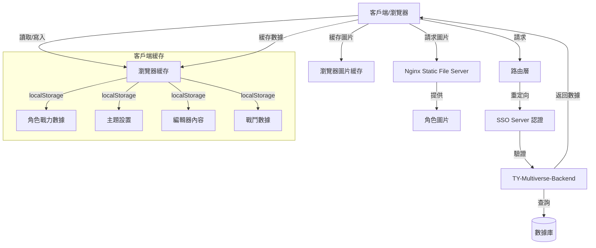
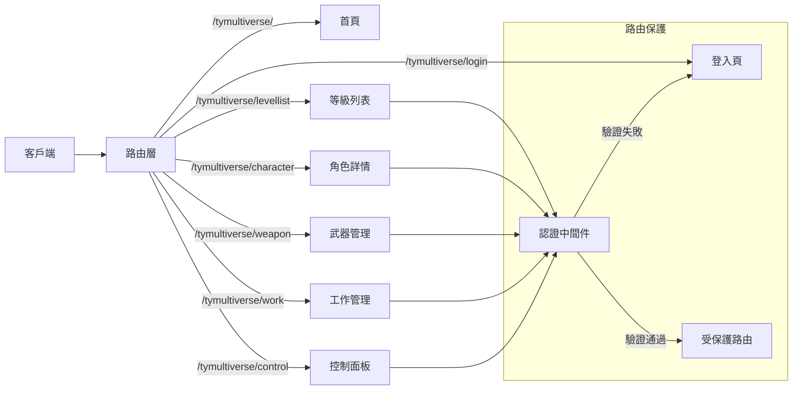
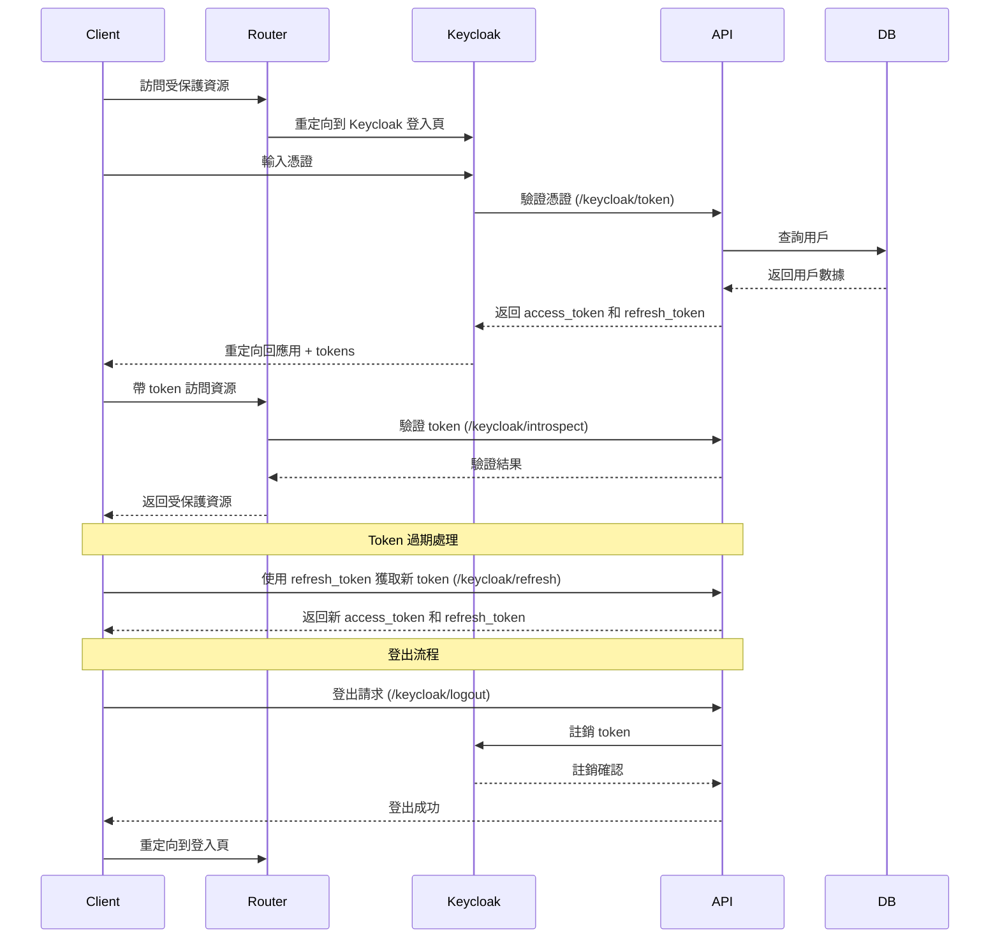
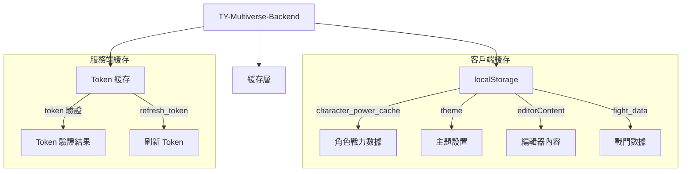

# TY-Multiverse 系統架構

## 系統概述

TY-Multiverse 是一個多維度管理系統，用於管理 TY 的個人專案。

## 架構圖

### 整體架構



### 路由架構



### SSO 認證流程



### 緩存架構



## 啟動方式

```bash
# 構建 Docker 鏡像
docker build --no-cache -t papakao/ty-multiverse-frontend .

# 運行容器
docker run -p 4321:4321 ty-multiverse-frontend

# 直接運行 Node.js
node ./dist/server/entry.mjs

# 構建 ARM64 架構鏡像
docker build --build-arg PLATFORM=linux/arm64 -t papakao/ty-multiverse-frontend .
docker push papakao/ty-multiverse-frontend:latest

# 構建並推送最新版本
docker build -t papakao/ty-multiverse-frontend:latest .
docker push papakao/ty-multiverse-frontend:latest
```