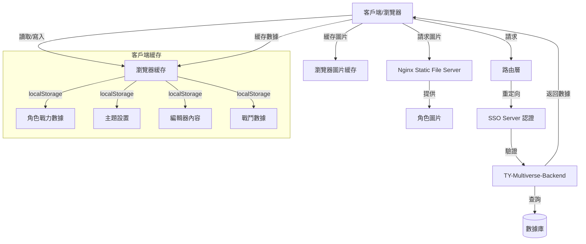
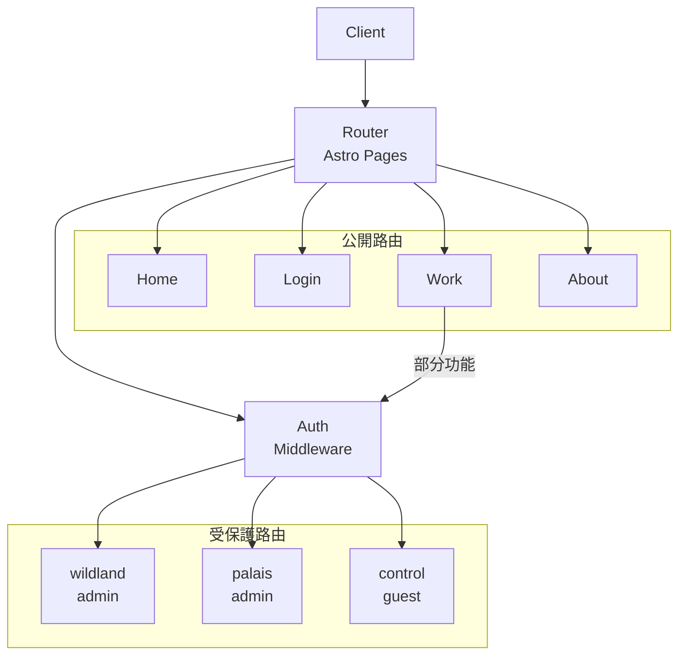
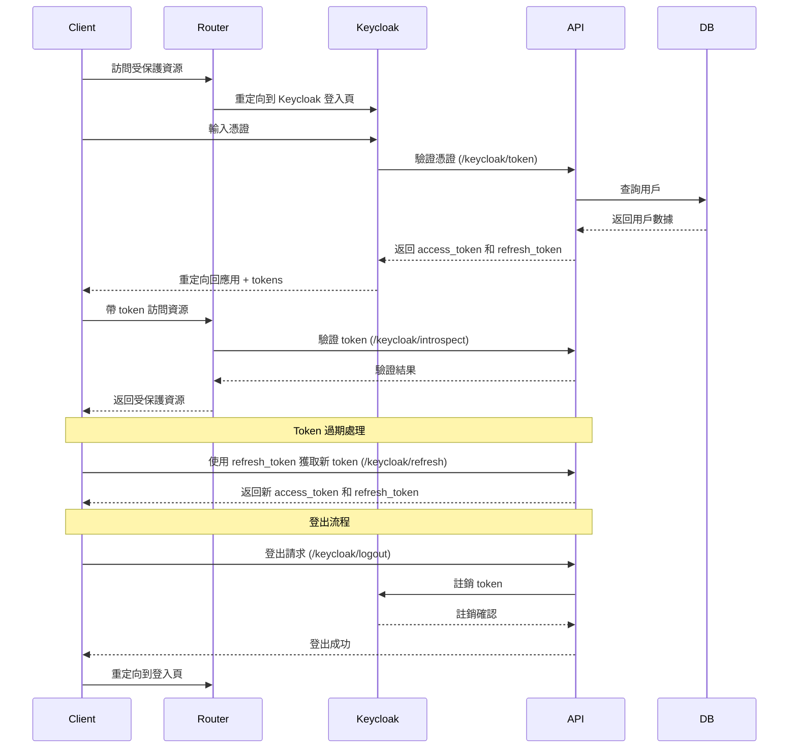
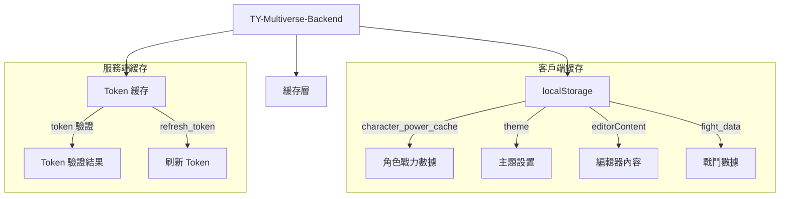
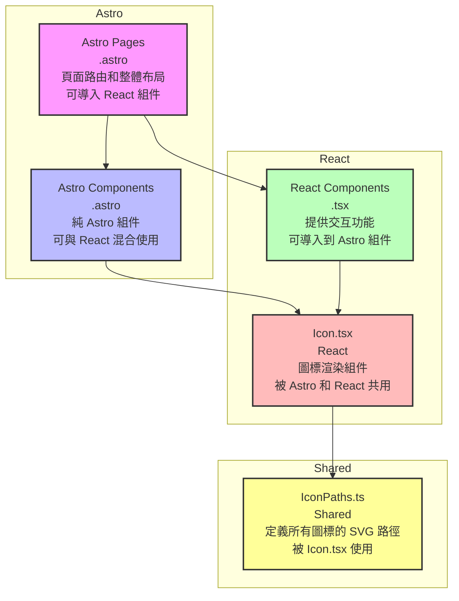

# TY-Multiverse 系統架構

## 系統概述

TY-Multiverse 是一個多維度管理系統，用於管理 TY 的個人專案。

## 架構圖

### 整體架構



### 路由架構



### SSO 認證流程



### 緩存架構



## 啟動方式

```bash
# 構建 Docker 鏡像
docker build --no-cache -t papakao/ty-multiverse-frontend .

# 運行容器
docker run -p 4321:4321 ty-multiverse-frontend

# 直接運行 Node.js
node ./dist/server/entry.mjs

# 構建 ARM64 架構鏡像
docker build --build-arg PLATFORM=linux/arm64 -t papakao/ty-multiverse-frontend .
docker push papakao/ty-multiverse-frontend:latest

# 構建並推送最新版本
docker build -t papakao/ty-multiverse-frontend:latest .
docker push papakao/ty-multiverse-frontend:latest
```

## 架構圖



1. Astro 頁面導入 React 組件
2. React 組件使用共享資源
3. 組件渲染結果被整合到最終的 HTML 輸出中

### Astro Pages 路由運作機制

1. **路由類型**
   - 靜態路由：直接映射到固定 URL
     - `/about.astro` -> `/about`
     - `/work/index.astro` -> `/work`
   - 動態路由：使用參數匹配多個 URL
     - `/work/[slug].astro` -> `/work/1`, `/work/2` 等
   - 嵌套路由：支持多層級 URL 結構

Astro 使用文件系統路由，路由由 `src/pages/` 目錄下的文件結構自動決定：

```
src/pages/
├── index.astro      -> /
├── about.astro      -> /about
├── work.astro       -> /work
├── work/[slug].astro -> /work/*
├── login.astro      -> /login
├── control.astro    -> /control
├── wildland.astro   -> /wildland
└── palais.astro     -> /palais
```
- 無需額外路由配置
- 支持靜態和動態路由
- 基於文件系統的自動路由映射
- 支持嵌套路由結構

### 動態路由與 Markdown 內容處理

Astro 的動態路由 `[slug].astro` 可以處理 Markdown 文件作為頁面內容：

```
src/
├── pages/
│   └── work/
│       └── [slug].astro    # 動態路由處理器
└── content/
    └── work/
        ├── project1.md     # Markdown 內容
        ├── project2.md     # Markdown 內容
        └── project3.md     # Markdown 內容
```

處理流程：
1. **內容組織**：
   - Markdown 文件放在 `src/content/work/` 目錄
   - 每個 `.md` 文件對應一個工作項目頁面

2. **路由匹配**：
   - URL `/work/project1` 會匹配 `[slug].astro`
   - `slug` 參數值為 "project1"

4. **頁面渲染**：
   - 解析 frontmatter（元數據）
   - 渲染 Markdown 內容為 HTML

- 無需手動創建每個頁面
- 支持 Markdown 格式的內容管理
- 可以添加自定義元數據（frontmatter）
- 支持內容預覽和草稿模式