# TY Multiverse Frontend

  

> The main frontend application unifying multiple project domains through a modern Astro and React hybrid architecture.

## Table of Contents

- [Implementation](#implementation)
- [Background](#background)
- [Install](#install)
- [Usage](#usage)
- [Architecture](#architecture)
- [Design Patterns](#design-patterns)
- [Deployment](#deployment)
- [Other](#other)

## Implementation

### 核心技術與架構設計

#### 技術棧
- **前端框架**：Astro + React，利用靜態生成與動態交互優勢
- **後端服務**：多服務架構（Django API、FastAPI、Spring Boot、Laravel）
- **數據層**：PostgreSQL、MongoDB、Redis 分層存儲
- **即時通訊**：WebSocket + RabbitMQ 事件驅動

#### 權限驗證機制
三層權限驗證系統確保靈活性與安全性：
- **管理員層**：`manage-users` 角色，訪問管理面板
- **用戶層**：標準 JWT token 驗證
- **訪客層**：基本 token 檢查或公開訪問

#### 動態內容與路由
- Markdown 文件通過文件系統自動映射為動態路由
- 依據 slug 自動生成頁面，支援多語言（中/英）
- Astro 靜態生成 + 部分動態路由並存架構

#### 系統核心設計模式

##### Producer–Consumer 架構
系統廣泛採用生產者-消費者模式，實現高併發與解耦：

1. **非同步計數系統**
   - Producer：前端事件經 REST API 推送至 Redis 佇列
   - Consumer：批次拉取事件，聚合後更新 MongoDB
   - 優勢：降低 DB 壓力，保證一致性

2. **AI 問答系統（三階段管道）**
   - **Stage 1**：查詢預處理與檢索
   - **Stage 2**：向量 Embedding（pgvector/pg_trgm）
   - **Stage 3**：LLM 生成答案
   - Producer 送入查詢，Consumer 並發處理，支援多 LLM 回退

3. **即時通知與廣播**
   - Producer：事件經 API 推送至 RabbitMQ
   - Consumer：分派給已訂閱客户端，經 WebSocket 推送
   - 實現：實時互動、狀態同步、離線消息隊列

#### 多層快取策略
結合客户端與服務器緩存提升效能：
- **Client 層**：localStorage 持久化，減少重複請求
- **Server 層**：Redis 高速快取，支援分布式失效
- **Cache Key 設計**：語言、用戶、查詢條件組合鍵

#### 部署與可靠性
- **容器化**：Docker 鏡像支援多架構（x86/ARM64）
- **CI/CD**：Jenkins 自動化測試、構建、部署
- **編排**：Kubernetes 支援自動擴展與負載均衡

---

## Background

### 系統概述

TY-Multiverse 是一個多維度管理系統，用於管理 TY 的個人專案。

本專案包含：
- **Frontend (Astro)** - 主前端應用
- **Video Service (Node.js)** - 影片合併服務（位於 `video-service/` 目錄）

## Install

### Node.js 版本

此專案使用 `astro@6`，開發與建置需使用 Node.js `>=22.12.0`。

如果你有使用 `nvm`，可在 `ty-multiverse-frontend/` 目錄執行：

```bash
nvm use
```

若本機尚未安裝對應版本：

```bash
nvm install 22.12.0
nvm use 22.12.0
```

### 啟動方式

```bash
npm install
npm run dev

## 構建 Docker 鏡像
docker build --no-cache -t papakao/ty-multiverse-frontend .

## 運行容器
docker run -p 4321:4321 ty-multiverse-frontend

## 直接運行 Node.js
node ./dist/server/entry.mjs

## 構建 ARM64 架構鏡像
docker build --build-arg PLATFORM=linux/arm64 -t papakao/ty-multiverse-frontend .
docker push papakao/ty-multiverse-frontend:latest

## 構建並推送最新版本
docker build -t papakao/ty-multiverse-frontend:latest .
docker push papakao/ty-multiverse-frontend:latest
```

## Usage

### API 文檔

#### 前端統一 API 管理

前端採用統一的 API 管理架構，所有 API 調用都通過 `src/pages/api/` 下的端點統一管理，並使用 `src/services/` 中的服務層進行調用。

##### People 模組 API

| API 端點 | 方法 | 描述 | 參數 | 響應 |
|---------|------|------|------|------|
| `/api/people/names` | GET | 獲取所有角色名稱 | 無 | `string[]` |
| `/api/people/get-by-name` | POST | 根據名稱查詢角色 | `{ name: string }` | `Person` |
| `/api/people/update` | POST | 更新角色資訊 | `Person` | `Person` |

##### Weapons 模組 API

| API 端點 | 方法 | 描述 | 參數 | 響應 |
|---------|------|------|------|------|
| `/api/weapons/index` | GET | 獲取所有武器 | 無 | `Weapon[]` |
| `/api/weapons/[name]` | GET | 根據名稱獲取武器 | URL 參數: name | `Weapon` |
| `/api/weapons/owner/[ownerName]` | GET | 根據所有者獲取武器 | URL 參數: ownerName | `Weapon[]` |

##### Gallery 模組 API

| API 端點 | 方法 | 描述 | 參數 | 響應 |
|---------|------|------|------|------|
| `/api/gallery/getAll` | POST | 獲取所有圖片 | 無 | `GalleryImage[]` |
| `/api/gallery/getById` | GET | 根據ID獲取圖片 | Query: `id` | `GalleryImage` |
| `/api/gallery/save` | POST | 保存圖片 | `{ imageBase64: string }` | `GalleryImage` |
| `/api/gallery/update` | POST | 更新圖片 | `{ id: number, imageBase64?: string }` | `GalleryImage` |
| `/api/gallery/delete` | POST | 刪除圖片 | `{ id: number }` | `void` |

##### Blackjack 遊戲 API

| API 端點 | 方法 | 描述 | 參數 | 響應 |
|---------|------|------|------|------|
| `/api/deckofcards/blackjack/start` | POST | 開始遊戲 | `{ playerName: string }` | `GameState` |
| `/api/deckofcards/blackjack/hit` | POST | 抽牌 | `{ gameId: string }` | `GameState` |
| `/api/deckofcards/blackjack/stand` | POST | 停牌 | `{ gameId: string }` | `GameState` |
| `/api/deckofcards/blackjack/end` | POST | 結束遊戲 | `{ gameId: string }` | `GameResult` |
| `/api/deckofcards/blackjack/state` | POST | 獲取遊戲狀態 | `{ gameId: string }` | `GameState` |
| `/api/deckofcards/blackjack/status` | POST | 獲取遊戲狀態 | `{ gameId: string }` | `GameStatus` |

##### 其他 API

| API 端點 | 方法 | 描述 | 參數 | 響應 |
|---------|------|------|------|------|
| `/api/qa-proxy` | POST | QA 系統代理 | `{ text: string }` | QA 回應 |
| `/api/sync-characters` | POST | 同步角色到 Google Apps Script | `Character[]` | `{ success: boolean, characterCount: number }` |

#### 服務層架構

所有前端組件都通過統一的服務層調用 API：

```
組件 (Component) → 服務層 (Service) → API 端點 (API Route) → 後端 (Backend)
```

##### 可用的服務

- **peopleService** - 處理 People 模組相關操作
- **weaponService** - 處理 Weapons 模組相關操作
- **galleryService** - 處理 Gallery 模組相關操作
- **syncService** - 處理數據同步相關操作
- **characterService** - 處理角色數據緩存和獲取

##### 服務使用示例

```typescript
// 使用 peopleService
import { peopleService } from '../services/peopleService';

// 獲取所有角色名稱
const names = await peopleService.getAllPeopleNames();

// 獲取特定角色
const person = await peopleService.getPersonByNameAndWait('角色名稱');
```

#### API 調用統一原則

1. **統一入口**: 所有 API 調用通過 `/api/*` 端點
2. **服務層封裝**: 使用服務層處理業務邏輯和錯誤處理
3. **類型安全**: 使用 TypeScript 類型定義確保數據結構一致性
4. **錯誤處理**: 統一的錯誤處理和用戶提示
5. **認證管理**: 自動處理 JWT token 認證
6. **響應快取**: 適當使用緩存減少重複請求

#### 路由架構

```mermaid
graph TD
    A[Client] --> B[Router<br>Astro Pages]
    B --> C[Home]
    B --> D[Login]
    B --> I[Work]
    B --> J[About]
    B --> E[Auth<br>Middleware]
    
    E --> F[wildland<br>admin]
    E --> G[palais<br>admin]
    E --> H[control<br>guest]
    
    I -->|部分功能| E
    
    subgraph 公開路由
        C
        D
        I
        J
    end
    
    subgraph 受保護路由
        F[wildland<br>需要 admin 權限]
        G[palais<br>需要 admin 權限]
        H[control<br>需要 user 權限]

        Note over F,G: Administrator functions only
        Note over H: User access required
    end
```

#### 認證與權限驗證流程

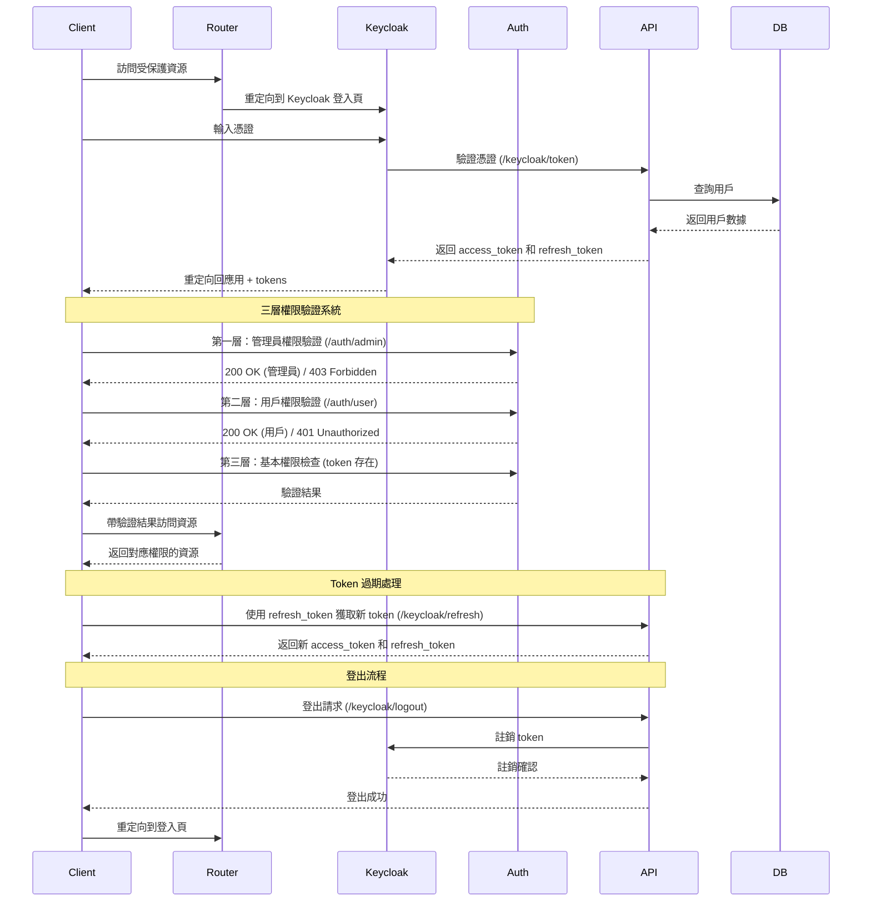
```mermaid
sequenceDiagram
    participant Client
    participant Router
    participant Keycloak
    participant Auth
    participant API
    participant DB
    
    Client->>Router: 訪問受保護資源
    Router->>Keycloak: 重定向到 Keycloak 登入頁
    Client->>Keycloak: 輸入憑證
    Keycloak->>API: 驗證憑證 (/keycloak/token)
    API->>DB: 查詢用戶
    DB-->>API: 返回用戶數據
    API-->>Keycloak: 返回 access_token 和 refresh_token
    Keycloak-->>Client: 重定向回應用 + tokens
    
    Note over Client,Auth: 三層權限驗證系統
    Client->>Auth: 第一層：管理員權限驗證 (/auth/admin)
    Auth-->>Client: 200 OK (管理員) / 403 Forbidden

    Client->>Auth: 第二層：用戶權限驗證 (/auth/user)
    Auth-->>Client: 200 OK (用戶) / 401 Unauthorized

    Client->>Auth: 第三層：基本權限檢查 (token 存在)
    Auth-->>Client: 驗證結果
    
    Client->>Router: 帶驗證結果訪問資源
    Router-->>Client: 返回對應權限的資源
    
    Note over Client,API: Token 過期處理
    Client->>API: 使用 refresh_token 獲取新 token (/keycloak/refresh)
    API-->>Client: 返回新 access_token 和 refresh_token
    
    Note over Client,API: 登出流程
    Client->>API: 登出請求 (/keycloak/logout)
    API->>Keycloak: 註銷 token
    Keycloak-->>API: 註銷確認
    API-->>Client: 登出成功
    Client->>Router: 重定向到登入頁
```

#### Auth API 權限系統

##### 權限層級
- **Admin (管理員)**：可訪問 `/auth/admin`，需要 `manage-users` 角色
- **User (用戶)**：可訪問 `/auth/user`，任何有效 token
- **Visitor (訪客)**：可訪問 `/auth/visitor`，無需驗證

##### 驗證流程
1. **第一層**：嘗試管理員權限驗證
   - 成功 → 設定 `isAdmin = true`, `hasUserAccess = true`
   - 失敗 → 進入第二層
2. **第二層**：嘗試用戶權限驗證
   - 成功 → 設定 `hasUserAccess = true`, `isAdmin = false`
   - 失敗 → 進入第三層
3. **第三層**：基本權限檢查
   - 有 token → 設定 `hasUserAccess = true`, `isAdmin = false`
   - 無 token → 設定所有權限為 `false`

##### Auth API 端點

```typescript
// 管理員端點
GET /auth/admin
Authorization: Bearer <token>
Response: 200 OK / 403 Forbidden / 401 Unauthorized

// 用戶端點
GET /auth/user
Authorization: Bearer <token>
Response: 200 OK / 401 Unauthorized

// 訪客端點
GET /auth/visitor
Response: 200 OK

// 認證測試端點
POST /auth/test
Authorization: Bearer <token>
Response: 200 OK / 401 Unauthorized

// 登出測試端點
POST /auth/logout-test
Authorization: Bearer <token>
Response: 200 OK / 401 Unauthorized

// 健康檢查端點
GET /auth/health
Response: 200 OK
```

#### 緩存架構

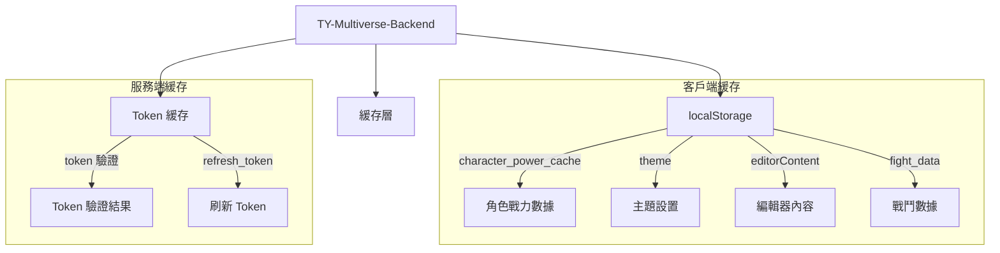
```mermaid
graph TD
    API[TY-Multiverse-Backend] --> Cache[緩存層]
    
    subgraph 客戶端緩存
        LocalStorage[localStorage]
        LocalStorage --> |character_power_cache| CharacterData[角色戰力數據]
        LocalStorage --> |theme| ThemeData[主題設置]
        LocalStorage --> |editorContent| EditorContent[編輯器內容]
        LocalStorage --> |fight_data| FightData[戰鬥數據]
    end
    
    subgraph 服務端緩存
        TokenCache[Token 緩存]
        TokenCache --> |token 驗證| TokenValidation[Token 驗證結果]
        TokenCache --> |refresh_token| RefreshToken[刷新 Token]
    end
    
    API --> LocalStorage
    API --> TokenCache
```

#### 訪問計數隊列流程(你是第幾個訪問者)

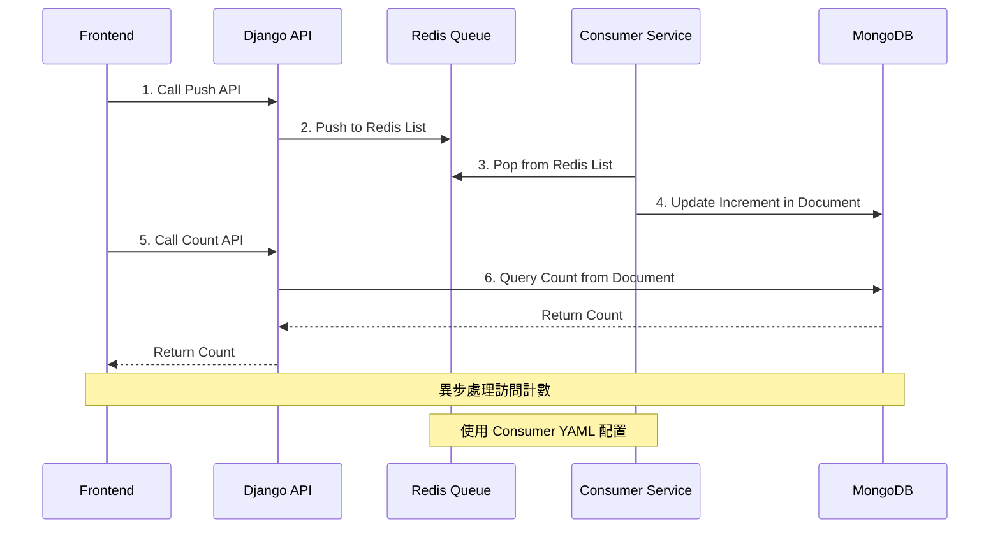
```mermaid
sequenceDiagram
    participant Frontend as Frontend
    participant Django as Django API
    participant Redis as Redis Queue
    participant Consumer as Consumer Service
    participant Mongo as MongoDB

    Frontend->>Django: 1. Call Push API
    Django->>Redis: 2. Push to Redis List
    Consumer->>Redis: 3. Pop from Redis List
    Consumer->>Mongo: 4. Update Increment in Document
    Frontend->>Django: 5. Call Count API
    Django->>Mongo: 6. Query Count from Document
    Mongo-->>Django: Return Count
    Django-->>Frontend: Return Count

    Note over Frontend,Mongo: 異步處理訪問計數
    Note over Redis,Consumer: 使用 Consumer YAML 配置
```

### Article Sync API 測試文檔

#### API 端點

##### 本地開發測試

**Linux/macOS (curl):**
```bash
## 檢查文件狀態 (GET)
curl -X GET "http://localhost:4321/tymultiverse/md-exporter"

## 執行同步 (POST)
curl -X POST "http://localhost:4321/tymultiverse/md-exporter" \
  -H "Content-Type: application/json" \
  -d '{"action": "sync"}'
```

**Windows PowerShell:**
```powershell
## 檢查文件狀態 (GET)
Invoke-RestMethod -Uri "http://localhost:4321/tymultiverse/md-exporter" -Method GET

## 執行同步 (POST)
Invoke-RestMethod -Uri "http://localhost:4321/tymultiverse/md-exporter" -Method POST -ContentType "application/json" -Body '{"action": "sync"}'
```

##### 生產環境測試

**Linux/macOS (curl):**
```bash
## 檢查文件狀態 (GET)
curl -X GET "https://peoplesystem.tatdvsonorth.com/tymultiverse/md-exporter"

## 執行同步 (POST)
curl -X POST "https://peoplesystem.tatdvsonorth.com/tymultiverse/md-exporter" \
  -H "Content-Type: application/json" \
  -d '{"action": "sync"}'
```

**Windows PowerShell:**
```powershell
## 檢查文件狀態 (GET)
Invoke-RestMethod -Uri "https://peoplesystem.tatdvsonorth.com/tymultiverse/md-exporter" -Method GET

## 執行同步 (POST)
Invoke-RestMethod -Uri "https://peoplesystem.tatdvsonorth.com/tymultiverse/md-exporter" -Method POST -ContentType "application/json" -Body '{"action": "sync"}'
```

#### 測試步驟

##### 步驟 1: 檢查當前狀態

**Linux/macOS:**
```bash
## 本地測試
curl -X GET "http://localhost:4321/tymultiverse/md-exporter" | jq

## 生產環境測試
curl -X GET "https://peoplesystem.tatdvsonorth.com/tymultiverse/md-exporter" | jq
```

**Windows PowerShell:**
```powershell
## 本地測試
Invoke-RestMethod -Uri "http://localhost:4321/tymultiverse/md-exporter" -Method GET | ConvertTo-Json -Depth 10

## 生產環境測試
Invoke-RestMethod -Uri "https://peoplesystem.tatdvsonorth.com/tymultiverse/md-exporter" -Method GET | ConvertTo-Json -Depth 10
```

預期回應：
```json
{
  "success": true,
  "data": {
    "total_files": 35,
    "existing_articles": 3,
    "file_status": [
      {
        "file_path": "interview-20250526.md",
        "local_content_length": 9123,
        "local_file_date": "2025-01-27 10:30:00",
        "exists_remotely": false,
        "remote_content_length": 0,
        "has_changes": true
      }
    ]
  }
}
```

##### 步驟 2: 執行同步

**Linux/macOS:**
```bash
## 本地測試
curl -X POST "http://localhost:4321/tymultiverse/md-exporter" \
  -H "Content-Type: application/json" \
  -d '{"action": "sync"}' | jq

## 生產環境測試
curl -X POST "https://peoplesystem.tatdvsonorth.com/tymultiverse/md-exporter" \
  -H "Content-Type: application/json" \
  -d '{"action": "sync"}' | jq
```

**Windows PowerShell:**
```powershell
## 本地測試
Invoke-RestMethod -Uri "http://localhost:4321/tymultiverse/md-exporter" -Method POST -ContentType "application/json" -Body '{"action": "sync"}' | ConvertTo-Json -Depth 10

## 生產環境測試
Invoke-RestMethod -Uri "https://peoplesystem.tatdvsonorth.com/tymultiverse/md-exporter" -Method POST -ContentType "application/json" -Body '{"action": "sync"}' | ConvertTo-Json -Depth 10
```

預期回應：
```json
{
  "success": true,
  "message": "Sync completed",
  "data": {
    "created": 35,
    "updated": 0,
    "unchanged": 0,
    "errors": 0,
    "details": [
      {
        "file_path": "interview-20250526.md",
        "status": "created",
        "message": "Article created successfully"
      }
    ]
  }
}
```

#### 自動化部署

##### Kubernetes CronJob
- 每天凌晨 2:00 自動執行同步
- 部署文件：`k8s/cronjob-sync-articles.yaml`
- 通過 Jenkins 自動部署

##### 手動觸發 CronJob
```bash
## 查看 CronJob 狀態
kubectl get cronjobs -n default

## 手動觸發一次同步
kubectl create job --from=cronjob/ty-multiverse-article-sync manual-sync-$(date +%s) -n default

## 查看執行日誌
kubectl logs job/manual-sync-$(date +%s) -n default
```

#### 監控和日誌

##### 查看同步日誌
```bash
## 查看最近的同步任務
kubectl get jobs -n default | grep ty-multiverse-article-sync

## 查看特定任務的日誌
kubectl logs job/ty-multiverse-article-sync-<timestamp> -n default
```

##### 檢查同步結果
```bash
## 檢查外部 API 的文章列表
curl -X GET "https://peoplesystem.tatdvsonorth.com/paprika/articles" | jq
```

## Architecture

### 架構圖

#### 整體架構

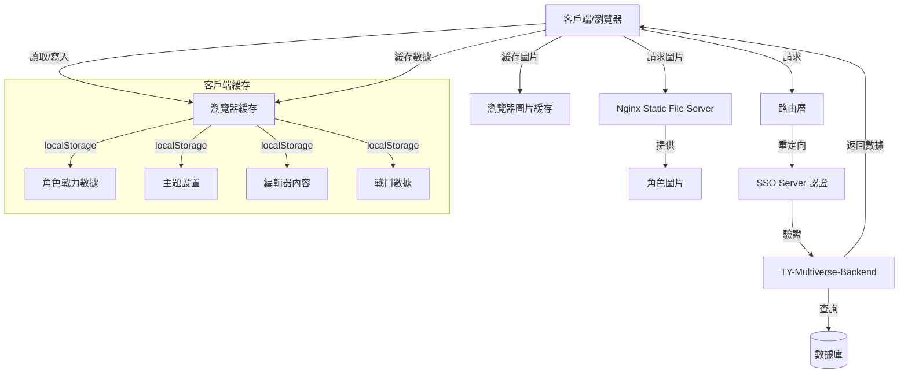
```mermaid
graph TD
    Client[客戶端/瀏覽器] --> |請求| Router[路由層]
    Router --> |重定向| SSO[SSO Server 認證]
    SSO --> |驗證| API[TY-Multiverse-Backend]
    API --> |查詢| DB[(數據庫)]
    
    Client --> |請求圖片| Nginx[Nginx Static File Server]
    Nginx --> |提供| Images[角色圖片]
    Client --> |緩存圖片| BrowserImageCache[瀏覽器圖片緩存]
    
    subgraph 客戶端緩存
        BrowserCache[瀏覽器緩存]
        BrowserCache --> |localStorage| CharacterData[角色戰力數據]
        BrowserCache --> |localStorage| ThemeData[主題設置]
        BrowserCache --> |localStorage| EditorContent[編輯器內容]
        BrowserCache --> |localStorage| FightData[戰鬥數據]
    end
    
    Client --> |讀取/寫入| BrowserCache
    API --> |返回數據| Client
    Client --> |緩存數據| BrowserCache
```

### 架構圖

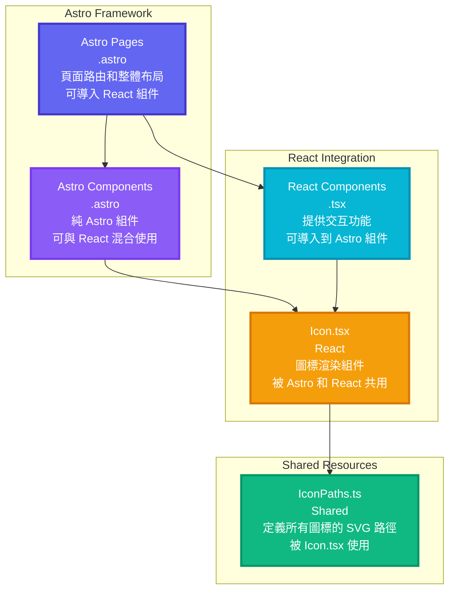
```mermaid
graph TD
    A[Astro Pages<br/>.astro<br/>頁面路由和整體布局<br/>可導入 React 組件] --> B[Astro Components<br/>.astro<br/>純 Astro 組件<br/>可與 React 混合使用]
    A --> C[React Components<br/>.tsx<br/>提供交互功能<br/>可導入到 Astro 組件]
    B --> D[Icon.tsx<br/>React<br/>圖標渲染組件<br/>被 Astro 和 React 共用]
    C --> D
    D --> E[IconPaths.ts<br/>Shared<br/>定義所有圖標的 SVG 路徑<br/>被 Icon.tsx 使用]
    
    subgraph "Astro Framework"
        A
        B
    end
    
    subgraph "React Integration"
        C
        D
    end
    
    subgraph "Shared Resources"
        E
    end

    %% Professional color scheme
    style A fill:#6366f1,stroke:#4338ca,stroke-width:3px,color:#ffffff
    style B fill:#8b5cf6,stroke:#7c3aed,stroke-width:3px,color:#ffffff
    style C fill:#06b6d4,stroke:#0891b2,stroke-width:3px,color:#ffffff
    style D fill:#f59e0b,stroke:#d97706,stroke-width:3px,color:#ffffff
    style E fill:#10b981,stroke:#059669,stroke-width:3px,color:#ffffff
    
    %% Subgraph styling
    classDef astroGroup fill:#f8fafc,stroke:#cbd5e1,stroke-width:2px
    classDef reactGroup fill:#f0f9ff,stroke:#7dd3fc,stroke-width:2px
    classDef sharedGroup fill:#f0fdf4,stroke:#86efac,stroke-width:2px
```

1. Astro 頁面導入 React 組件
2. React 組件使用共享資源
3. 組件渲染結果被整合到最終的 HTML 輸出中

#### API Gateway 路由架構

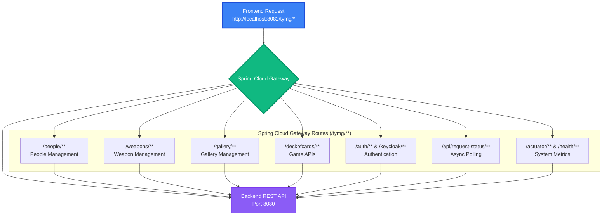
```mermaid
graph TD
    A[Frontend Request<br/>http://localhost:8082/tymg/*] --> B{Spring Cloud Gateway}

    B --> C[Backend REST API<br/>Port 8080]

    subgraph "Spring Cloud Gateway Routes (/tymg/**)"
        D["/people/**<br/>People Management"]
        E["/weapons/**<br/>Weapon Management"]
        F["/gallery/**<br/>Gallery Management"]
        G["/deckofcards/**<br/>Game APIs"]
        H["/auth/** & /keycloak/**<br/>Authentication"]
        I["/api/request-status/**<br/>Async Polling"]
        J["/actuator/** & /health/**<br/>System Metrics"]
    end

    B --> D
    B --> E
    B --> F
    B --> G
    B --> H
    B --> I
    B --> J

    D --> C
    E --> C
    F --> C
    G --> C
    H --> C
    I --> C
    J --> C

    %% Styling
    style A fill:#3b82f6,stroke:#1d4ed8,stroke-width:3px,color:#ffffff
    style B fill:#10b981,stroke:#059669,stroke-width:3px,color:#ffffff
    style C fill:#8b5cf6,stroke:#7c3aed,stroke-width:2px,color:#ffffff

    %% Subgraph styling
    classDef gatewayGroup fill:#f0fdf4,stroke:#86efac,stroke-width:2px
```


#### Astro Pages 路由運作機制

1. **路由類型**
   - 靜態路由：直接映射到固定 URL
     - `/about.astro` -> `/about`
     - `/work/index.astro` -> `/work`
   - 動態路由：使用參數匹配多個 URL
     - `/work/[slug].astro` -> `/work/1`, `/work/2` 等
   - 嵌套路由：支持多層級 URL 結構

Astro 使用文件系統路由，路由由 `src/pages/` 目錄下的文件結構自動決定：

```
src/pages/
├── index.astro      -> /
├── about.astro      -> /about
├── work.astro       -> /work
├── work/[slug].astro -> /work/*
├── login.astro      -> /login
├── control.astro    -> /control
├── wildland.astro   -> /wildland
└── palais.astro     -> /palais
```
- 無需額外路由配置
- 支持靜態和動態路由
- 基於文件系統的自動路由映射
- 支持嵌套路由結構

#### 動態路由與 Markdown 內容處理

Astro 的動態路由 `[slug].astro` 可以處理 Markdown 文件作為頁面內容：

```
src/
├── pages/
│   └── work/
│       └── [slug].astro    # 動態路由處理器
└── content/
    └── work/
        ├── project1.md     # Markdown 內容
        ├── project2.md     # Markdown 內容
        └── project3.md     # Markdown 內容
```

處理流程：
1. **內容組織**：
   - Markdown 文件放在 `src/content/work/` 目錄
   - 每個 `.md` 文件對應一個工作項目頁面

2. **路由匹配**：
   - URL `/work/project1` 會匹配 `[slug].astro`
   - `slug` 參數值為 "project1"

4. **頁面渲染**：
   - 解析 frontmatter（元數據）
   - 渲染 Markdown 內容為 HTML

- 無需手動創建每個頁面
- 支持 Markdown 格式的內容管理
- 可以添加自定義元數據（frontmatter）
- 支持內容預覽和草稿模式

### 問答系統架構

#### 整體架構流程

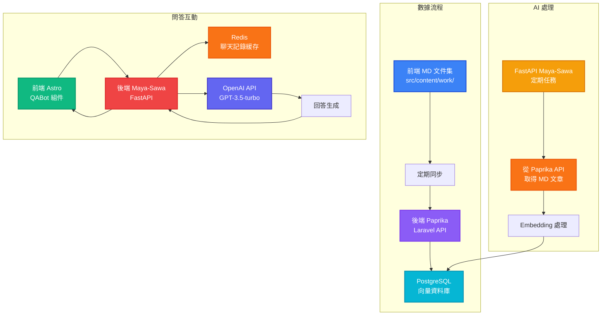
```mermaid
graph TD
    A[前端 MD 文件集<br/>src/content/work/] --> B[定期同步]
    B --> C[後端 Paprika<br/>Laravel API]
    C --> D[PostgreSQL<br/>向量資料庫]
    
    E[FastAPI Maya-Sawa<br/>定期任務] --> F[從 Paprika API<br/>取得 MD 文章]
    F --> G[Embedding 處理]
    G --> D
    
    H[前端 Astro<br/>QABot 組件] --> I[後端 Maya-Sawa<br/>FastAPI]
    I --> J[Redis<br/>聊天記錄緩存]
    I --> K[OpenAI API<br/>GPT-3.5-turbo]
    
    K --> L[回答生成]
    L --> I
    I --> H
    
    subgraph "數據流程"
        A
        B
        C
        D
    end
    
    subgraph "AI 處理"
        E
        F
        G
    end
    
    subgraph "問答互動"
        H
        I
        J
        K
        L
    end
    
    %% 顏色主題
    style A fill:#3b82f6,stroke:#1d4ed8,stroke-width:2px,color:#ffffff
    style C fill:#8b5cf6,stroke:#7c3aed,stroke-width:2px,color:#ffffff
    style D fill:#06b6d4,stroke:#0891b2,stroke-width:2px,color:#ffffff
    style E fill:#f59e0b,stroke:#d97706,stroke-width:2px,color:#ffffff
    style F fill:#f97316,stroke:#ea580c,stroke-width:2px,color:#ffffff
    style H fill:#10b981,stroke:#059669,stroke-width:2px,color:#ffffff
    style I fill:#ef4444,stroke:#dc2626,stroke-width:2px,color:#ffffff
    style J fill:#f97316,stroke:#ea580c,stroke-width:2px,color:#ffffff
    style K fill:#6366f1,stroke:#4338ca,stroke-width:2px,color:#ffffff
```

#### 詳細流程說明

##### 1. 數據同步階段
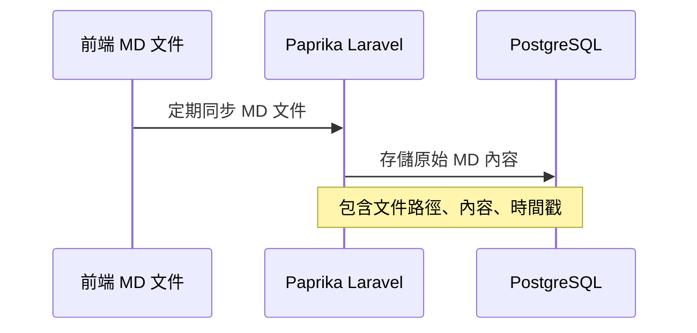
```mermaid
sequenceDiagram
    participant Frontend as 前端 MD 文件
    participant Paprika as Paprika Laravel
    participant PG as PostgreSQL
    
    Frontend->>Paprika: 定期同步 MD 文件
    Paprika->>PG: 存儲原始 MD 內容
    Note over Paprika,PG: 包含文件路徑、內容、時間戳
```

##### 2. Embedding 處理階段
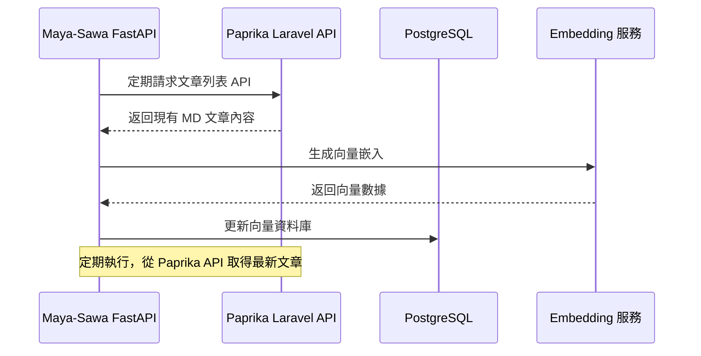
```mermaid
sequenceDiagram
    participant MayaSawa as Maya-Sawa FastAPI
    participant Paprika as Paprika Laravel API
    participant PG as PostgreSQL
    participant Embedding as Embedding 服務
    
    MayaSawa->>Paprika: 定期請求文章列表 API
    Paprika-->>MayaSawa: 返回現有 MD 文章內容
    MayaSawa->>Embedding: 生成向量嵌入
    Embedding-->>MayaSawa: 返回向量數據
    MayaSawa->>PG: 更新向量資料庫
    Note over MayaSawa,Paprika: 定期執行，從 Paprika API 取得最新文章
```

##### 3. 問答互動階段
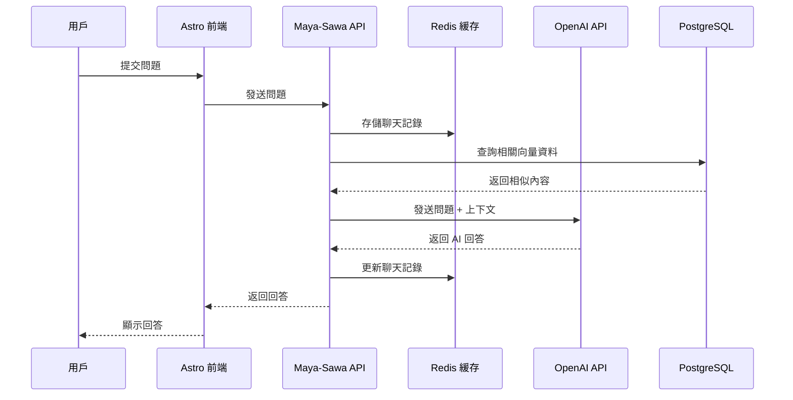
```mermaid
sequenceDiagram
    participant User as 用戶
    participant Astro as Astro 前端
    participant MayaSawa as Maya-Sawa API
    participant Redis as Redis 緩存
    participant OpenAI as OpenAI API
    participant PG as PostgreSQL
    
    User->>Astro: 提交問題
    Astro->>MayaSawa: 發送問題
    MayaSawa->>Redis: 存儲聊天記錄
    MayaSawa->>PG: 查詢相關向量資料
    PG-->>MayaSawa: 返回相似內容
    MayaSawa->>OpenAI: 發送問題 + 上下文
    OpenAI-->>MayaSawa: 返回 AI 回答
    MayaSawa->>Redis: 更新聊天記錄
    MayaSawa-->>Astro: 返回回答
    Astro-->>User: 顯示回答
```

## Design Patterns

### 🎯 設計模式 (Design Patterns)

前端架構注重可重用性與數據流控制，採用以下設計模式：

- **外觀模式 (Facade Pattern)**: 透過統一的 Service 層 (`peopleService`, `weaponService`) 封裝 API 呼叫，對 UI 層隱藏後端與網路請求的複雜度。
- **組件模式 (Component Pattern)**: 透過 Astro 與 React 的混合架構將 UI 劃分為獨立、高重用性的組件。
- **觀察者模式 (Observer Pattern)**: 運用 React 的狀態管理與 Hook 機制，實現組件視圖對底層數據變化的響應。

## Deployment

### CI/CD Pipeline

#### 1. Pipeline Overview
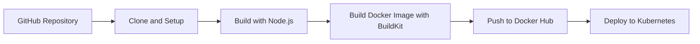
```mermaid
graph LR
    A[GitHub Repository] --> B[Clone and Setup]
    B --> C[Build with Node.js]
    C --> D[Build Docker Image with BuildKit]
    D --> E[Push to Docker Hub]
    E --> F[Deploy to Kubernetes]
```

#### 2. Pipeline Components

##### 2.1 Agent Configuration
- **Node Container**: `node:18`
- **Docker Container**: `docker:23-dind`
- **Kubectl Container**: `bitnami/kubectl:latest`

## Troubleshooting

### Vite 7 Plugin Transform Hook Compatibility (Astro 6.1.x)

#### Problem
When using Astro 6.1.x with Vite 7.3.1, the dev server may crash with:
```
TypeError: Cannot read properties of undefined (reading 'call')
  at EnvironmentPluginContainer.transform (config.js:28797:51)
```

#### Root Cause
Vite 7 introduced a new plugin hook syntax where `transform` can be an object with `filter` and `handler` properties:
```ts
// Vite 7 syntax
transform: {
  filter: { id: /\.jsx$/ },
  handler(code, id) { ... }
}
```

However, Astro 6.1.x did not fully support this syntax. The `@vitejs/plugin-react`, `@astrojs/mdx`, and other integrations were updated in Astro 6.4.x to properly implement the new Vite 7 plugin hooks.

When the handler is missing or improperly defined, `getHookHandler(plugin.transform)` returns `undefined`, causing the crash:
```ts
// vite/dist/node/chunks/config.js:28795
const handler = getHookHandler(plugin.transform);  // returns undefined
result = await this.handleHookPromise(handler.call(ctx, code, id, optionsWithSSR));  // ← TypeError
```

#### Solution
Upgrade Astro and integrations to latest minor versions:

```bash
npm install astro@^6.4.7 @astrojs/react@^5.0.7 @astrojs/mdx@latest
```

**Version requirements:**
- `astro` ≥ 6.4.7
- `@astrojs/react` ≥ 5.0.7
- `@astrojs/mdx` ≥ 6.0.3
- `vite` ≥ 7.3.5 (pulled in automatically)

#### Why It Happens
Astro 6.1.2 was released before Vite 7 final release. By 6.4.7, all integrations had been updated to properly handle Vite 7's new plugin hook object form with both `filter` and `handler` properties.

#### Verification
After upgrade, dev server should start without errors and all pages should load correctly.

---

### Market Overview 儀表板（Usage / Portfolio）顯示不出資料

#### 問題現象
首頁 `Market Overview` 的 **Usage** 與 **Account Portfolio** 區塊一直顯示 `Offline` / `--`，
但 **臺股期貨（TXF）/ 小台積（QFFR1）** 報價卻正常。

#### 根因（三個獨立問題疊加）
1. **`market-internal-secret` 是空值（0 bytes）**
   - 前端 server route `src/pages/api/market/{usage,portfolio}.ts` 用 `X-Internal-Secret`
     向 maya-sawa 的 `/market/internal/*` 端點取資料；secret 為空時直接回 `503 Internal secret not configured`。
   - 來源：Jenkins credential `MARKET_INTERNAL_SECRET` 當初是空的，Deploy 階段
     `kubectl create secret ... --from-literal=MARKET_INTERNAL_SECRET=""` 把它建成空字串。
   - 修法：用非空值重建 secret；並在 `Jenkinsfile` 加防呆——credential 為空時**不覆寫**既有 secret。
2. **連線埠錯誤（8000 vs 80）**
   - maya-sawa 的 `Service` 只開 **port 80**（`targetPort: 8000`），但程式與 deployment env
     都指向 `http://maya-sawa:8000`，叢集內根本連不上（connection refused / timeout）。
   - 修法：改為 `http://maya-sawa/maya-sawa`（走 service port 80）。
3. **Astro 在 build 時把 `import.meta.env` 寫死**
   - server-only 變數 `import.meta.env.MARKET_INTERNAL_SECRET` 在 **build 階段被 inline 成 `undefined`**，
     執行期再怎麼設 k8s env 都沒用（實測：`process.env` 讀得到 48 bytes，但 route 仍回 503）。
   - 修法：server route 改用 **`process.env.MARKET_INTERNAL_SECRET`**（執行期讀取，密鑰也不會被烤進前端 bundle）。

#### 驗證指令（叢集內，不外洩密鑰）
```bash
## 確認 secret 不是空的
kubectl describe secret market-internal-secret      # 應為 48 bytes，不是 0

## 從 maya-sawa pod 用自身 env 的密鑰打自己的 internal 端點（應回 200 + 真實資料）
kubectl exec <maya-pod> -- python3 -c 'import os,urllib.request; \
  r=urllib.request.urlopen(urllib.request.Request("http://localhost:8000/maya-sawa/market/internal/usage", \
  headers={"X-Internal-Secret":os.getenv("MARKET_INTERNAL_SECRET","")})); print(r.status, r.read()[:200])'

## 從前端 pod 確認 server route（修好後應回 200，未修前回 503）
kubectl exec <frontend-pod> -- node -e 'fetch("http://localhost:4321/api/market/usage").then(r=>r.text()).then(console.log)'
```

> 重點教訓：**前端 server route 的機密一律用 `process.env`，不要用 `import.meta.env`**；
> 叢集內呼叫服務務必對齊 `Service` 實際 port。

### 期貨（Futures）無資料、但證券（Stock）正常

#### 問題現象
`Account Portfolio` 的證券部分（現金、總資產、未實現損益、持股 donut）都正常，
但 **Futures equity / Equity amount / Available margin / Open position P/L** 全部 `Unavailable`，
且 `Futures Positions` 顯示 `0 contracts`。

#### 根因
maya-sawa 的 `ShioajiMarketService._fetch_portfolio()`（`maya_sawa/services/shioaji_market.py`）
**只查股票帳戶**（`account_balance` + `list_stock_positions`），完全沒有查期貨帳戶。
前端 `index.ts` 早已預期 `futuresSummary / futuresPositions / stockPositions / signedQuantity`
欄位，但後端從未產生 → 期貨區塊永遠是 `Unavailable`。

#### 修法（後端補上期貨查詢）
- `ReadOnlyShioajiClient` 新增 `list_futures_positions()`（`list_positions(futopt_account)`）與 `margin()`。
- `_fetch_portfolio` 補抓期貨部位與權益／保證金，輸出 `futuresPositions` / `futuresSummary` / `stockPositions`。
- **帶號口數陷阱**：Shioaji `position.quantity` 是「絕對口數」，做空也回正數；
  必須用 `direction`（`Buy`/`Sell`）換算 `signedQuantity = -quantity if Sell else quantity`。
- 期貨權益欄位：`margin.equity` / `equity_amount` / `available_margin` / `future_open_position`。
- 成本價用 `position.price`、未實現損益用 `position.pnl`；`last_price` 不保證存在，
  缺值時改用合約快照 `api.snapshots([contract])[0].close` 取現價。

> 期貨帳務查詢（`list_positions` / `margin`）屬「帳務類」API，限速 25 次/5 秒且吃流量配額，
> 因此沿用既有的 Redis 快取機制（`SHIOAJI_PORTFOLIO_CACHE_SECONDS`，預設 1 小時刷新一次），不可高頻輪詢。

---

## Other

### Video Merge Service

#### 概述

Video Merge Service 是一個整合在前端專案中的 Node.js 服務，專門用於處理影片合併和去背功能。

#### 目錄結構

```
ty-multiverse-frontend/
├── video-service/
│   ├── src/
│   │   ├── index.js          # Express 伺服器
│   │   ├── routes/
│   │   │   └── video.js      # 影片 API 路由
│   │   ├── services/
│   │   │   ├── ffmpeg.js     # FFmpeg 處理邏輯
│   │   │   └── download.js   # 影片下載
│   │   └── utils/
│   │       └── color.js      # 背景色偵測
│   ├── temp/                 # 暫存目錄
│   ├── output/               # 輸出目錄
│   ├── Dockerfile            # 容器化配置
│   └── README.md
├── k8s/
│   └── ffmpeg.sh             # K8s 部署腳本
└── package.json              # 包含 video service 依賴
```

#### 本地開發

##### 1. 安裝 FFmpeg

詳細安裝指南請參考 `AGENTS.md` 中的 "FFmpeg Setup" 章節。

**Windows:**
```powershell
choco install ffmpeg
```

**macOS:**
```bash
brew install ffmpeg
```

**Linux:**
```bash
sudo apt install ffmpeg
```

##### 2. 啟動服務

```bash
## 安裝依賴
npm install

## 啟動 video service
npm run video-service

## 或使用 nodemon 開發模式
npm run video-service:dev
```

服務將在 `http://localhost:3000` 運行。

##### 3. 測試 API

```bash
## Health check
curl http://localhost:3000/health

## 測試影片合併
curl -X POST http://localhost:3000/api/videos/merge \
  -H "Content-Type: application/json" \
  -d '{
    "videoUrls": [
      "http://peoplesystem.tatdvsonorth.com/images/people/Lily.mp4",
      "http://peoplesystem.tatdvsonorth.com/images/people/Yuki1.mp4",
      "http://peoplesystem.tatdvsonorth.com/images/people/Anna.mp4",
      "http://peoplesystem.tatdvsonorth.com/images/people/Maria2.mp4"
    ],
    "outputFormat": "webm",
    "removeBackground": true
  }'
```

#### API 端點

| API 端點 | 方法 | 描述 | 參數 | 響應 |
|---------|------|------|------|------|
| `/health` | GET | 健康檢查 | 無 | `{ status: 'ok', service: 'video-merge-service' }` |
| `/api/videos/merge` | POST | 合併 4 個影片 | `{ videoUrls: string[], outputFormat: string, removeBackground: boolean }` | `{ status: 'success', outputUrl: string, duration: number, fileSize: number }` |
| `/api/videos/download/:filename` | GET | 下載合併後的影片 | URL 參數: filename | 影片檔案 |
| `/api/videos/cleanup/:filename` | DELETE | 刪除已處理的影片 | URL 參數: filename | `{ status: 'success', message: string }` |

#### 功能特性

- **影片合併**: 合併 4 個 480x832 影片為 1920x1080
- **自動去背**: 偵測並移除背景色（黑色/綠色）
- **透明背景**: 輸出支援透明度的 WebM 格式
- **背景色偵測**: 使用 Canvas API 分析影片第一幀的主要顏色

#### 環境變數

| 變數 | 預設值 | 說明 |
|------|--------|------|
| `PORT` | 3000 | 服務端口 |
| `NODE_ENV` | development | 環境模式 |
| `PUBLIC_VIDEO_SERVICE_URL` | http://localhost:3000 (dev)<br/>https://video.tatdvsonorth.com (prod) | Video Service URL |

#### 生產環境部署

##### Docker 部署

```bash
## 建立 Docker image
docker build -f video-service/Dockerfile -t your-registry/video-merge-service:latest .

## 推送到 registry
docker push your-registry/video-merge-service:latest
```

##### Kubernetes 部署

```bash
## 使用一鍵部署腳本
cd k8s
chmod +x ffmpeg.sh
./ffmpeg.sh
```

部署腳本會自動：
- 建立 `video-service` namespace
- 部署 2 個 replica 的 video service
- 配置 Ingress (video.tatdvsonorth.com)
- 設定健康檢查和資源限制

#### 架構說明

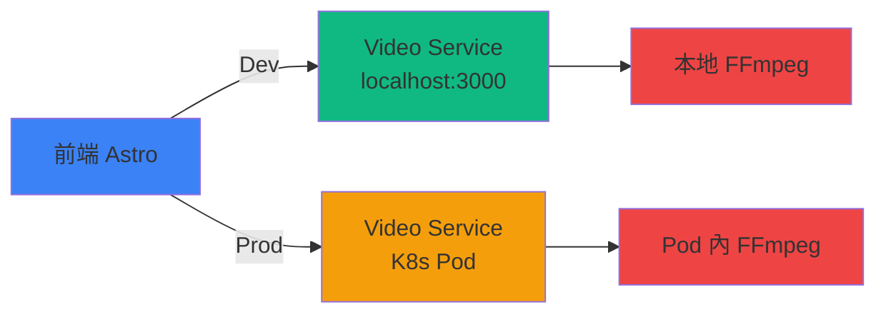
```mermaid
graph LR
    A[前端 Astro] -->|Dev| B[Video Service<br/>localhost:3000]
    A -->|Prod| C[Video Service<br/>K8s Pod]
    B --> D[本地 FFmpeg]
    C --> E[Pod 內 FFmpeg]
    
    style A fill:#3b82f6
    style B fill:#10b981
    style C fill:#f59e0b
    style D fill:#ef4444
    style E fill:#ef4444
```

#### 注意事項

- Dev 環境需要本地安裝 FFmpeg
- 處理時間約 10-30 秒/影片
- 建議記憶體: 512MB - 2GB
- 磁碟空間需求: 5-10GB（暫存 + 輸出）

#### 相關文件

- [Video Service README](video-service/README.md) - 詳細文檔
- [AGENTS.md](AGENTS.md) - FFmpeg 安裝指南
- [k8s/ffmpeg.sh](k8s/ffmpeg.sh) - K8s 部署腳本


## Current Frontend Runtime Architecture

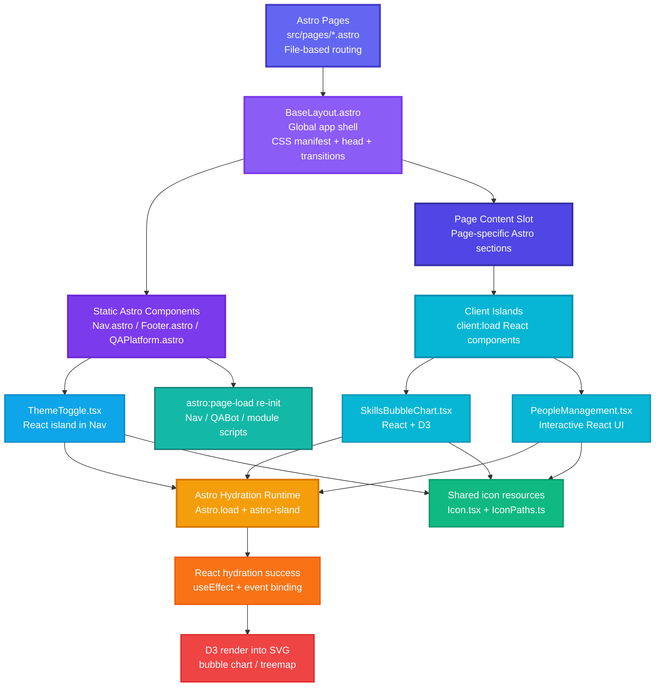
```mermaid
graph TD
    A[Astro Pages<br/>src/pages/*.astro<br/>File-based routing] --> B[BaseLayout.astro<br/>Global app shell<br/>CSS manifest + head + transitions]
    B --> C[Static Astro Components<br/>Nav.astro / Footer.astro / QAPlatform.astro]
    B --> D[Page Content Slot<br/>Page-specific Astro sections]

    C --> E[ThemeToggle.tsx<br/>React island in Nav]
    D --> F[Client Islands<br/>client:load React components]
    F --> G[SkillsBubbleChart.tsx<br/>React + D3]
    F --> H[PeopleManagement.tsx<br/>Interactive React UI]

    E --> I[Astro Hydration Runtime<br/>Astro.load + astro-island]
    G --> I
    H --> I
    I --> J[React hydration success<br/>useEffect + event binding]
    J --> K[D3 render into SVG<br/>bubble chart / treemap]

    C --> L[astro:page-load re-init<br/>Nav / QABot / module scripts]
    E --> M[Shared icon resources<br/>Icon.tsx + IconPaths.ts]
    G --> M
    H --> M

    style A fill:#6366f1,stroke:#4338ca,stroke-width:3px,color:#ffffff
    style B fill:#8b5cf6,stroke:#7c3aed,stroke-width:3px,color:#ffffff
    style C fill:#7c3aed,stroke:#6d28d9,stroke-width:3px,color:#ffffff
    style D fill:#4f46e5,stroke:#3730a3,stroke-width:3px,color:#ffffff
    style E fill:#0ea5e9,stroke:#0284c7,stroke-width:2px,color:#ffffff
    style F fill:#06b6d4,stroke:#0891b2,stroke-width:3px,color:#ffffff
    style G fill:#06b6d4,stroke:#0891b2,stroke-width:2px,color:#ffffff
    style H fill:#06b6d4,stroke:#0891b2,stroke-width:2px,color:#ffffff
    style I fill:#f59e0b,stroke:#d97706,stroke-width:3px,color:#ffffff
    style J fill:#f97316,stroke:#ea580c,stroke-width:2px,color:#ffffff
    style K fill:#ef4444,stroke:#dc2626,stroke-width:2px,color:#ffffff
    style L fill:#14b8a6,stroke:#0f766e,stroke-width:2px,color:#ffffff
    style M fill:#10b981,stroke:#059669,stroke-width:2px,color:#ffffff
```

1. Astro pages render through `BaseLayout.astro`, which owns the global shell, stylesheet links, and transitions setup.
2. Interactive features run as Astro client islands, so hydration must succeed before React effects or D3 rendering can start.
3. Module scripts such as Nav/QABot logic are re-initialized on `astro:page-load` under the current view-transitions architecture.
