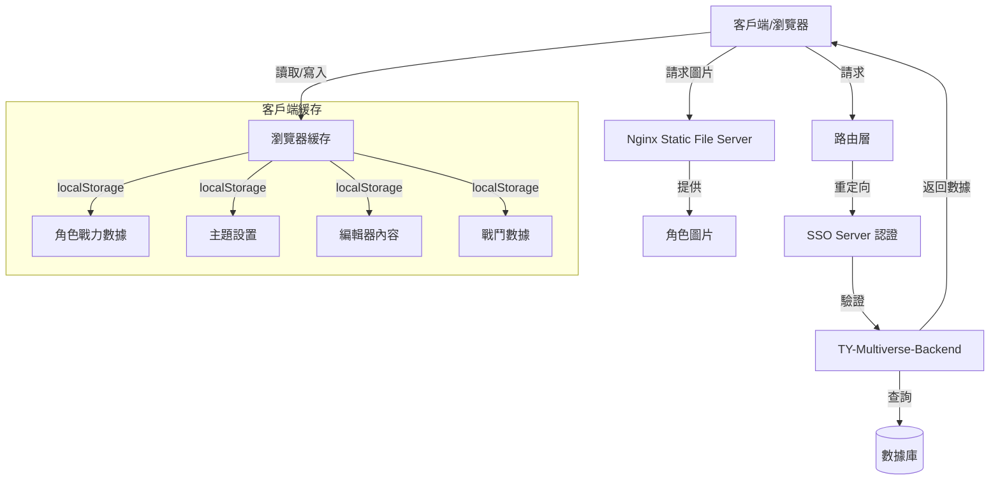
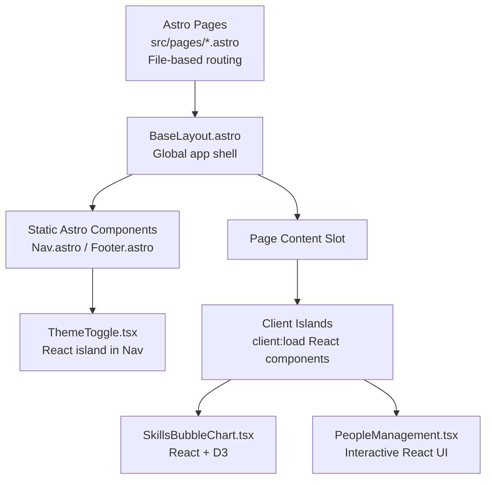
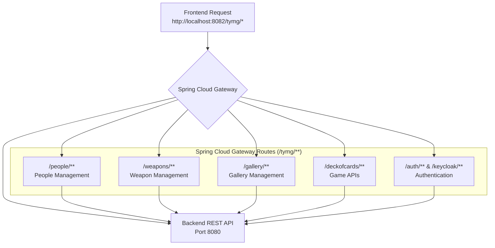
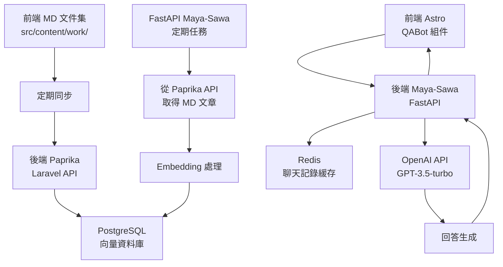
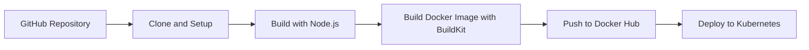

# TY Multiverse Frontend

  

> The main frontend application unifying multiple project domains through a modern Astro and React hybrid architecture.

## Table of Contents

- [Background](#background)
- [Architecture](#architecture)
- [Design Patterns](#design-patterns)
- [Other](#other)

## Background

### 系統概述

TY-Multiverse 前端為多維度管理系統，包含：
- **Frontend (Astro)** - 主前端應用（`astro@6`，需 Node.js >= 22.12.0）
- **Video Service (Node.js)** - 影片合併服務（`video-service/` 目錄）

### 核心技術與架構設計

#### 技術棧
- **前端框架**：Astro + React，靜態生成與動態交互
- **後端服務**：多服務架構（FastAPI、Spring Boot）
- **數據層**：PostgreSQL、MongoDB、Redis
- **即時通訊**：WebSocket + RabbitMQ 事件驅動

#### 權限驗證機制（三層）
- **管理員層**：`manage-users` 角色，訪問管理面板
- **用戶層**：標準 JWT token 驗證
- **訪客層**：基本 token 檢查或公開訪問

#### 系統核心設計模式

##### Producer–Consumer 架構
1. **非同步計數系統**：前端事件 → Redis 佇列 → Consumer 批次更新 MongoDB
2. **AI 問答系統**：三階段管道（查詢預處理 → Embedding → LLM 生成）
3. **即時通知**：事件 → RabbitMQ → WebSocket 推送

#### 多層快取策略
- **Client 層**：localStorage 持久化
- **Server 層**：Redis 高速快取
- **Cache Key 設計**：語言、用戶、查詢條件組合鍵

## Architecture

### 整體架構

```mermaid
graph TD
    Client[客戶端/瀏覽器] --> |請求| Router[路由層]
    Router --> |重定向| SSO[SSO Server 認證]
    SSO --> |驗證| API[TY-Multiverse-Backend]
    API --> |查詢| DB[(數據庫)]
    
    Client --> |請求圖片| Nginx[Nginx Static File Server]
    Nginx --> |提供| Images[角色圖片]
    
    subgraph 客戶端緩存
        BrowserCache[瀏覽器緩存]
        BrowserCache --> |localStorage| CharacterData[角色戰力數據]
        BrowserCache --> |localStorage| ThemeData[主題設置]
        BrowserCache --> |localStorage| EditorContent[編輯器內容]
        BrowserCache --> |localStorage| FightData[戰鬥數據]
    end
    
    Client --> |讀取/寫入| BrowserCache
    API --> |返回數據| Client
```

### Astro 組件架構

```mermaid
graph TD
    A[Astro Pages<br/>src/pages/*.astro<br/>File-based routing] --> B[BaseLayout.astro<br/>Global app shell]
    B --> C[Static Astro Components<br/>Nav.astro / Footer.astro]
    B --> D[Page Content Slot]

    C --> E[ThemeToggle.tsx<br/>React island in Nav]
    D --> F[Client Islands<br/>client:load React components]
    F --> G[SkillsBubbleChart.tsx<br/>React + D3]
    F --> H[PeopleManagement.tsx<br/>Interactive React UI]
```

### API Gateway 路由架構

```mermaid
graph TD
    A[Frontend Request<br/>http://localhost:8082/tymg/*] --> B{Spring Cloud Gateway}
    B --> C[Backend REST API<br/>Port 8080]

    subgraph "Spring Cloud Gateway Routes (/tymg/**)"
        D["/people/**<br/>People Management"]
        E["/weapons/**<br/>Weapon Management"]
        F["/gallery/**<br/>Gallery Management"]
        G["/deckofcards/**<br/>Game APIs"]
        H["/auth/** & /keycloak/**<br/>Authentication"]
    end

    B --> D
    B --> E
    B --> F
    B --> G
    B --> H

    D --> C
    E --> C
    F --> C
    G --> C
    H --> C
```

### 問答系統架構

```mermaid
graph TD
    A[前端 MD 文件集<br/>src/content/work/] --> B[定期同步]
    B --> C[後端 Paprika<br/>Laravel API]
    C --> D[PostgreSQL<br/>向量資料庫]
    
    E[FastAPI Maya-Sawa<br/>定期任務] --> F[從 Paprika API<br/>取得 MD 文章]
    F --> G[Embedding 處理]
    G --> D
    
    H[前端 Astro<br/>QABot 組件] --> I[後端 Maya-Sawa<br/>FastAPI]
    I --> J[Redis<br/>聊天記錄緩存]
    I --> K[OpenAI API<br/>GPT-3.5-turbo]
    K --> L[回答生成]
    L --> I
    I --> H
```

### CI/CD Pipeline

```mermaid
graph LR
    A[GitHub Repository] --> B[Clone and Setup]
    B --> C[Build with Node.js]
    C --> D[Build Docker Image with BuildKit]
    D --> E[Push to Docker Hub]
    E --> F[Deploy to Kubernetes]
```

## Design Patterns

### 🎯 設計模式 (Design Patterns)

- **外觀模式 (Facade Pattern)**: 透過統一的 Service 層封裝 API 呼叫，對 UI 層隱藏後端與網路請求的複雜度。
- **組件模式 (Component Pattern)**: 透過 Astro 與 React 的混合架構將 UI 劃分為獨立、高重用性的組件。
- **觀察者模式 (Observer Pattern)**: 運用 React 的狀態管理與 Hook 機制，實現組件視圖對底層數據變化的響應。

## Other

### People 模組 API 端點

| API 端點 | 方法 | 描述 |
|---------|------|------|
| `/api/people/names` | GET | 獲取所有角色名稱 |
| `/api/people/get-by-name` | POST | 根據名稱查詢角色 |
| `/api/people/update` | POST | 更新角色資訊 |

### Video Merge Service

影片合併服務位於 `video-service/` 目錄，提供：
- 合併 4 個 480x832 影片為 1920x1080
- 自動去背（偵測黑色/綠色背景）
- 輸出支援透明度的 WebM 格式

服務 URL：`http://localhost:3000`（dev）/ `https://video.tatdvsonorth.com`（prod）

> 啟動指令、API 測試範例、Article Sync 操作、Video Service 部署、Troubleshooting 請見 [AGENTS.md](AGENTS.md)。
