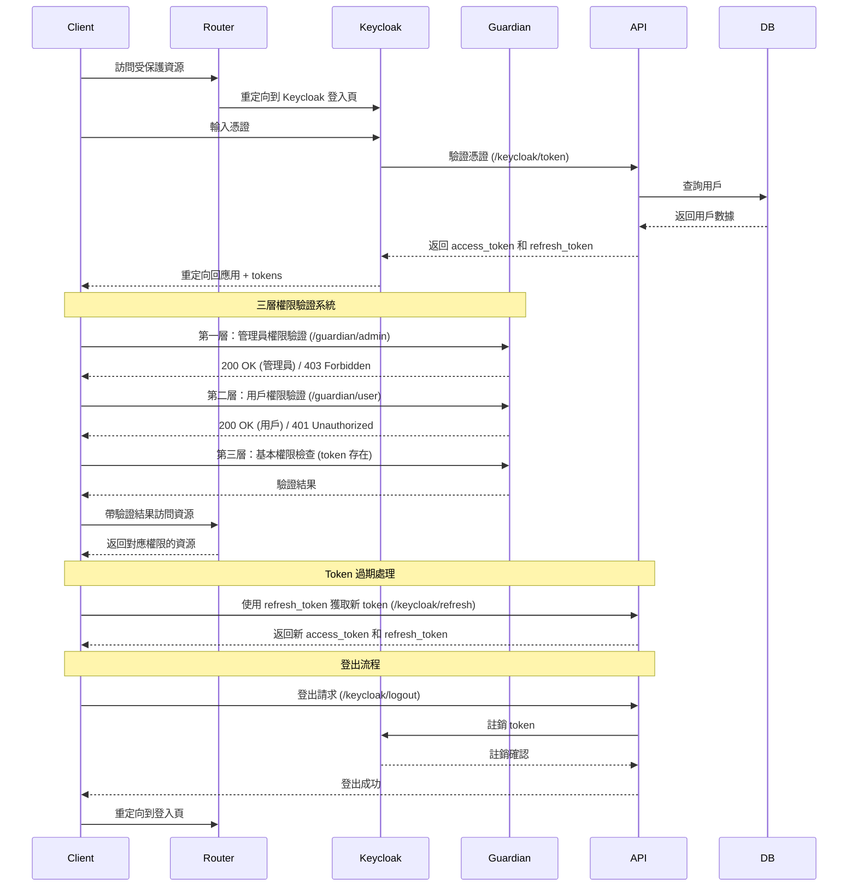

# TY-Multiverse 系統架構

## 系統概述

TY-Multiverse 是一個多維度管理系統，用於管理 TY 的個人專案。

## 架構圖

### 整體架構


### 路由架構

```mermaid
graph TD
    A[Client] --> B[Router<br>Astro Pages]
    B --> C[Home]
    B --> D[Login]
    B --> I[Work]
    B --> J[About]
    B --> E[Auth<br>Middleware]
    
    E --> F[wildland<br>admin]
    E --> G[palais<br>admin]
    E --> H[control<br>guest]
    
    I -->|部分功能| E
    
    subgraph 公開路由
        C
        D
        I
        J
    end
    
    subgraph 受保護路由
        F[wildland<br>需要 admin 權限]
        G[palais<br>需要 admin 權限]
        H[control<br>需要 user 權限]

        Note over F,G: 管理員專用功能
        Note over H: 用戶權限即可使用
    end
```

### 認證與權限驗證流程



### Guardian API 權限系統

#### 權限層級
- **Admin (管理員)**：可訪問 `/guardian/admin`，需要 `manage-users` 角色
- **User (用戶)**：可訪問 `/guardian/user`，任何有效 token
- **Visitor (訪客)**：可訪問 `/guardian/visitor`，無需驗證

#### 驗證流程
1. **第一層**：嘗試管理員權限驗證
   - 成功 → 設定 `isAdmin = true`, `hasUserAccess = true`
   - 失敗 → 進入第二層
2. **第二層**：嘗試用戶權限驗證
   - 成功 → 設定 `hasUserAccess = true`, `isAdmin = false`
   - 失敗 → 進入第三層
3. **第三層**：基本權限檢查
   - 有 token → 設定 `hasUserAccess = true`, `isAdmin = false`
   - 無 token → 設定所有權限為 `false`

#### Guardian API 端點

```typescript
// 管理員端點
GET /guardian/admin
Authorization: Bearer <token>
Response: 200 OK / 403 Forbidden / 401 Unauthorized

// 用戶端點  
GET /guardian/user
Authorization: Bearer <token>
Response: 200 OK / 401 Unauthorized

// 訪客端點
GET /guardian/visitor
Response: 200 OK
```

### 緩存架構


### 訪問計數隊列流程(你是第幾個訪問者)


## 啟動方式

```bash
# 構建 Docker 鏡像
docker build --no-cache -t papakao/ty-multiverse-frontend .

# 運行容器
docker run -p 4321:4321 ty-multiverse-frontend

# 直接運行 Node.js
node ./dist/server/entry.mjs

# 構建 ARM64 架構鏡像
docker build --build-arg PLATFORM=linux/arm64 -t papakao/ty-multiverse-frontend .
docker push papakao/ty-multiverse-frontend:latest

# 構建並推送最新版本
docker build -t papakao/ty-multiverse-frontend:latest .
docker push papakao/ty-multiverse-frontend:latest
```

## 架構圖


1. Astro 頁面導入 React 組件
2. React 組件使用共享資源
3. 組件渲染結果被整合到最終的 HTML 輸出中

### Astro Pages 路由運作機制

1. **路由類型**
   - 靜態路由：直接映射到固定 URL
     - `/about.astro` -> `/about`
     - `/work/index.astro` -> `/work`
   - 動態路由：使用參數匹配多個 URL
     - `/work/[slug].astro` -> `/work/1`, `/work/2` 等
   - 嵌套路由：支持多層級 URL 結構

Astro 使用文件系統路由，路由由 `src/pages/` 目錄下的文件結構自動決定：

```
src/pages/
├── index.astro      -> /
├── about.astro      -> /about
├── work.astro       -> /work
├── work/[slug].astro -> /work/*
├── login.astro      -> /login
├── control.astro    -> /control
├── wildland.astro   -> /wildland
└── palais.astro     -> /palais
```
- 無需額外路由配置
- 支持靜態和動態路由
- 基於文件系統的自動路由映射
- 支持嵌套路由結構

### 動態路由與 Markdown 內容處理

Astro 的動態路由 `[slug].astro` 可以處理 Markdown 文件作為頁面內容：

```
src/
├── pages/
│   └── work/
│       └── [slug].astro    # 動態路由處理器
└── content/
    └── work/
        ├── project1.md     # Markdown 內容
        ├── project2.md     # Markdown 內容
        └── project3.md     # Markdown 內容
```

處理流程：
1. **內容組織**：
   - Markdown 文件放在 `src/content/work/` 目錄
   - 每個 `.md` 文件對應一個工作項目頁面

2. **路由匹配**：
   - URL `/work/project1` 會匹配 `[slug].astro`
   - `slug` 參數值為 "project1"

4. **頁面渲染**：
   - 解析 frontmatter（元數據）
   - 渲染 Markdown 內容為 HTML

- 無需手動創建每個頁面
- 支持 Markdown 格式的內容管理
- 可以添加自定義元數據（frontmatter）
- 支持內容預覽和草稿模式

## CI/CD Pipeline

### 1. Pipeline Overview


### 2. Pipeline Components

#### 2.1 Agent Configuration
- **Node Container**: `node:18`
- **Docker Container**: `docker:23-dind`
- **Kubectl Container**: `bitnami/kubectl:1.30.7`

## Article Sync API 測試文檔

### API 端點

#### 本地開發測試

**Linux/macOS (curl):**
```bash
# 檢查文件狀態 (GET)
curl -X GET "http://localhost:4321/tymultiverse/md-exporter"

# 執行同步 (POST)
curl -X POST "http://localhost:4321/tymultiverse/md-exporter" \
  -H "Content-Type: application/json" \
  -d '{"action": "sync"}'
```

**Windows PowerShell:**
```powershell
# 檢查文件狀態 (GET)
Invoke-RestMethod -Uri "http://localhost:4321/tymultiverse/md-exporter" -Method GET

# 執行同步 (POST)
Invoke-RestMethod -Uri "http://localhost:4321/tymultiverse/md-exporter" -Method POST -ContentType "application/json" -Body '{"action": "sync"}'
```

#### 生產環境測試

**Linux/macOS (curl):**
```bash
# 檢查文件狀態 (GET)
curl -X GET "https://peoplesystem.tatdvsonorth.com/tymultiverse/md-exporter"

# 執行同步 (POST)
curl -X POST "https://peoplesystem.tatdvsonorth.com/tymultiverse/md-exporter" \
  -H "Content-Type: application/json" \
  -d '{"action": "sync"}'
```

**Windows PowerShell:**
```powershell
# 檢查文件狀態 (GET)
Invoke-RestMethod -Uri "https://peoplesystem.tatdvsonorth.com/tymultiverse/md-exporter" -Method GET

# 執行同步 (POST)
Invoke-RestMethod -Uri "https://peoplesystem.tatdvsonorth.com/tymultiverse/md-exporter" -Method POST -ContentType "application/json" -Body '{"action": "sync"}'
```

### 測試步驟

#### 步驟 1: 檢查當前狀態

**Linux/macOS:**
```bash
# 本地測試
curl -X GET "http://localhost:4321/tymultiverse/md-exporter" | jq

# 生產環境測試
curl -X GET "https://peoplesystem.tatdvsonorth.com/tymultiverse/md-exporter" | jq
```

**Windows PowerShell:**
```powershell
# 本地測試
Invoke-RestMethod -Uri "http://localhost:4321/tymultiverse/md-exporter" -Method GET | ConvertTo-Json -Depth 10

# 生產環境測試
Invoke-RestMethod -Uri "https://peoplesystem.tatdvsonorth.com/tymultiverse/md-exporter" -Method GET | ConvertTo-Json -Depth 10
```

預期回應：
```json
{
  "success": true,
  "data": {
    "total_files": 35,
    "existing_articles": 3,
    "file_status": [
      {
        "file_path": "interview-20250526.md",
        "local_content_length": 9123,
        "local_file_date": "2025-01-27 10:30:00",
        "exists_remotely": false,
        "remote_content_length": 0,
        "has_changes": true
      }
    ]
  }
}
```

#### 步驟 2: 執行同步

**Linux/macOS:**
```bash
# 本地測試
curl -X POST "http://localhost:4321/tymultiverse/md-exporter" \
  -H "Content-Type: application/json" \
  -d '{"action": "sync"}' | jq

# 生產環境測試
curl -X POST "https://peoplesystem.tatdvsonorth.com/tymultiverse/md-exporter" \
  -H "Content-Type: application/json" \
  -d '{"action": "sync"}' | jq
```

**Windows PowerShell:**
```powershell
# 本地測試
Invoke-RestMethod -Uri "http://localhost:4321/tymultiverse/md-exporter" -Method POST -ContentType "application/json" -Body '{"action": "sync"}' | ConvertTo-Json -Depth 10

# 生產環境測試
Invoke-RestMethod -Uri "https://peoplesystem.tatdvsonorth.com/tymultiverse/md-exporter" -Method POST -ContentType "application/json" -Body '{"action": "sync"}' | ConvertTo-Json -Depth 10
```

預期回應：
```json
{
  "success": true,
  "message": "Sync completed",
  "data": {
    "created": 35,
    "updated": 0,
    "unchanged": 0,
    "errors": 0,
    "details": [
      {
        "file_path": "interview-20250526.md",
        "status": "created",
        "message": "Article created successfully"
      }
    ]
  }
}
```

### 自動化部署

#### Kubernetes CronJob
- 每天凌晨 2:00 自動執行同步
- 部署文件：`k8s/cronjob-sync-articles.yaml`
- 通過 Jenkins 自動部署

#### 手動觸發 CronJob
```bash
# 查看 CronJob 狀態
kubectl get cronjobs -n default

# 手動觸發一次同步
kubectl create job --from=cronjob/ty-multiverse-article-sync manual-sync-$(date +%s) -n default

# 查看執行日誌
kubectl logs job/manual-sync-$(date +%s) -n default
```

### 監控和日誌

#### 查看同步日誌
```bash
# 查看最近的同步任務
kubectl get jobs -n default | grep ty-multiverse-article-sync

# 查看特定任務的日誌
kubectl logs job/ty-multiverse-article-sync-<timestamp> -n default
```

#### 檢查同步結果
```bash
# 檢查外部 API 的文章列表
curl -X GET "https://peoplesystem.tatdvsonorth.com/paprika/articles" | jq
```

## 問答系統架構

### 整體架構流程


### 詳細流程說明

#### 1. 數據同步階段


#### 2. Embedding 處理階段


#### 3. 問答互動階段

