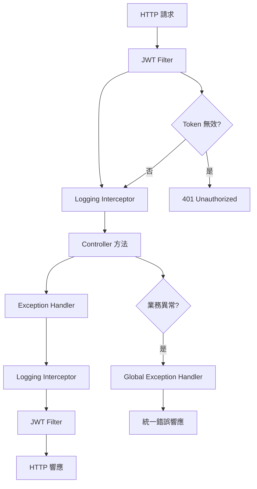

#### Spring Boot 請求響應設計：Controller Advice 與 Middleware 實戰教學

在現代 Spring Boot 應用中，我們追求「單一職責原則」。Controller 應專注於接收請求和調用服務，而不應被大量重複的基礎設施代碼（如錯誤處理、日誌、資料格式化）污染。

本文將指導您如何使用 Spring 提供的核心機制，將這些通用的「中間件（Middleware）」功能解耦出來。

#### 三個核心攔截點：選擇你的「中間件」

在 Spring MVC 的請求生命週期中，有三個主要的攔截點供您實現 Middleware 功能。選擇正確的位置是設計的關鍵。

| 攔截點 | Spring 元件 | 職責/應用場景 | 優勢 |
|-------|------------|--------------|------|
| **技術層** | Servlet Filter | 處理最通用、最底層的請求。例如 CORS、JWT 驗證、壓縮、請求/響應時間記錄。 | 發生在 DispatcherServlet 之前，可以拒絕無效請求，是最早的防線。 |
| **框架層** | Handler Interceptor | 處理與 Spring MVC 環境相關的邏輯。例如細粒度授權、日誌、多次 HTTP 請求防護（Debouncing）。 | 可以存取 Handler（即 Controller 方法），適合前/後處理。 |
| **異常處理層** | @ControllerAdvice | 集中處理應用程式拋出的所有異常（包括資料驗證錯誤、業務邏輯錯誤）。 | 將錯誤處理與業務代碼完全分離，實現統一的 JSON 錯誤響應格式。 |

#### @ControllerAdvice：統一的錯誤處理中心

Controller Advice 是 Spring 處理異常響應的標準且優雅的方式。它允許您在一個集中的類中，為應用程式中所有的 Controller 方法定義錯誤處理邏輯。

##### 核心實作：定義全局異常處理器

使用 @ControllerAdvice 標註一個類，並在其中使用 @ExceptionHandler 標註方法，來匹配和處理特定的異常。

```java
import org.springframework.http.HttpStatus;
import org.springframework.http.ResponseEntity;
import org.springframework.web.bind.MethodArgumentNotValidException;
import org.springframework.web.bind.annotation.ControllerAdvice;
import org.springframework.web.bind.annotation.ExceptionHandler;

@ControllerAdvice
public class GlobalExceptionHandler {

    // 自定義錯誤響應的DTO
    private static class ErrorResponse {
        public String message;
        public int status;
        public ErrorResponse(String message, int status) {
            this.message = message;
            this.status = status;
        }
    }

    /**
     * 處理業務邏輯中拋出的自定義資源未找到異常
     */
    @ExceptionHandler(ResourceNotFoundException.class)
    public ResponseEntity<ErrorResponse> handleResourceNotFound(ResourceNotFoundException ex) {
        // 返回 404 Not Found
        return new ResponseEntity<>(
            new ErrorResponse(ex.getMessage(), HttpStatus.NOT_FOUND.value()),
            HttpStatus.NOT_FOUND
        );
    }

    /**
     * 處理 @Valid 註解觸發的參數驗證失敗異常
     */
    @ExceptionHandler(MethodArgumentNotValidException.class)
    public ResponseEntity<ErrorResponse> handleValidationExceptions(MethodArgumentNotValidException ex) {
        // 提取第一個驗證錯誤訊息
        String errorMessage = ex.getBindingResult().getFieldError().getDefaultMessage();

        // 返回 400 Bad Request
        return new ResponseEntity<>(
            new ErrorResponse("驗證失敗: " + errorMessage, HttpStatus.BAD_REQUEST.value()),
            HttpStatus.BAD_REQUEST
        );
    }
}
```

##### 設計優勢

- **集中管理**：所有 try-catch 邏輯從 Controller 和 Service 層移除。
- **清晰響應**：確保所有錯誤響應都具有統一的 JSON 格式和正確的 HTTP Status Code。
- **代碼純淨**：Controller 方法可以專注於成功路徑，只需在業務失敗時拋出具體的業務異常。

#### Servlet Filter：實現 JWT 驗證的 Middleware

Filter 是實現 JWT 驗證和用戶上下文建立的黃金標準，因為它在 Spring MVC 啟動前就執行，可以提早拒絕無效請求。

##### 核心實作：驗證 JWT 並傳遞上下文

Filter 的關鍵在於將解析出的用戶資訊綁定到執行緒（通常透過 Spring Security 的 SecurityContextHolder）。

```java
import org.springframework.security.core.Authentication;
import org.springframework.security.core.context.SecurityContextHolder;
import org.springframework.stereotype.Component;
import org.springframework.web.filter.OncePerRequestFilter;

@Component // 註冊為 Spring Bean
public class JwtAuthenticationFilter extends OncePerRequestFilter {

    private final JwtService jwtService;

    public JwtAuthenticationFilter(JwtService jwtService) {
        this.jwtService = jwtService;
    }

    @Override
    protected void doFilterInternal(HttpServletRequest request,
                                    HttpServletResponse response,
                                    FilterChain filterChain)
            throws ServletException, IOException {

        String authHeader = request.getHeader("Authorization");

        if (authHeader != null && authHeader.startsWith("Bearer ")) {
            String token = authHeader.substring(7);

            try {
                // 1. 驗證並解析 JWT，獲取用戶詳情 (例如 User ID, 權限)
                Authentication authentication = jwtService.getAuthentication(token);

                // 2. 綁定到執行緒上下文 (Thread Context)
                // 使得 Controller 和 Service 層可以透過 SecurityContextHolder 訪問
                SecurityContextHolder.getContext().setAuthentication(authentication);

            } catch (Exception e) {
                // 驗證失敗 (例如 Token 過期、無效)
                response.setStatus(HttpServletResponse.SC_UNAUTHORIZED);
                return; // 終止請求處理
            }
        }

        // 3. 繼續處理鏈，將控制權交給 DispatcherServlet
        filterChain.doFilter(request, response);
    }
}
```

##### 設計優勢

- **性能提升**：無效的請求（無 Token 或 Token 無效）在 Filter 層就被阻止，避免了進入 Spring MVC 框架和業務服務的開銷。
- **上下文傳遞**：一旦 Authentication 綁定到 Thread，後續的 Controller 或 Service 層無需處理 JWT 的複雜細節，直接使用 SecurityContextHolder 即可獲取用戶 ID。

#### Handler Interceptor：請求的精準控制

Interceptor 適用於需要在 Controller 方法執行前、後或完成時執行的邏輯，特別適合需要存取目標 Controller 元數據（如 @GetMapping 方法名）的場景。

##### 核心實作：日誌和性能監控

可以利用 Interceptor 測量一個 Controller 方法從開始到結束的執行時間。

```java
import org.springframework.web.servlet.HandlerInterceptor;
import javax.servlet.http.HttpServletRequest;
import javax.servlet.http.HttpServletResponse;

public class LoggingInterceptor implements HandlerInterceptor {

    // 將當前時間存入 Request 屬性中
    @Override
    public boolean preHandle(HttpServletRequest request, HttpServletResponse response, Object handler) throws Exception {
        request.setAttribute("startTime", System.currentTimeMillis());
        return true; // 必須返回 true 才能繼續執行
    }

    // 在 Controller 方法執行完畢但 View 還沒渲染時執行
    @Override
    public void afterCompletion(HttpServletRequest request, HttpServletResponse response, Object handler, Exception ex) throws Exception {
        Long startTime = (Long) request.getAttribute("startTime");
        long duration = System.currentTimeMillis() - startTime;

        // 輸出日誌：請求路徑、執行時間、狀態碼
        System.out.println("Request: " + request.getRequestURI() +
                           " | Status: " + response.getStatus() +
                           " | Duration: " + duration + "ms");
    }
}
```

##### 配置 Interceptor

Interceptor 必須在配置類中註冊才能生效：

```java
import org.springframework.context.annotation.Configuration;
import org.springframework.web.servlet.config.annotation.InterceptorRegistry;
import org.springframework.web.servlet.config.annotation.WebMvcConfigurer;

@Configuration
public class WebMvcConfig implements WebMvcConfigurer {

    @Override
    public void addInterceptors(InterceptorRegistry registry) {
        // 註冊 Interceptor 並指定攔截的路徑
        registry.addInterceptor(new LoggingInterceptor())
                .addPathPatterns("/api/**")
                .excludePathPatterns("/api/public/**"); // 排除公開接口
    }
}
```

##### 設計優勢

- **精準時機**：能夠精確地在 Controller 方法執行前後插入邏輯，不會像 Filter 那樣包含參數解析、視圖解析等額外開銷。
- **方法級別存取**：Interceptor 可以透過 Object handler 存取到目標方法和其上的註解。

#### 實戰應用：完整的請求處理流程

讓我們看看一個完整的請求是如何通過這三層 Middleware 處理的：

```java
// 請求流程：Filter → Interceptor → Controller → Interceptor → Filter

// 1. Filter 層：JWT 驗證
//    - 檢查 Authorization header
//    - 驗證 Token 有效性
//    - 建立用戶上下文

// 2. Interceptor 層：請求前處理
//    - 記錄請求開始時間
//    - 檢查用戶權限

// 3. Controller 層：業務邏輯
@RestController
@RequestMapping("/api/users")
public class UserController {

    @GetMapping("/{id}")
    public ResponseEntity<User> getUser(@PathVariable Long id) {
        User user = userService.findById(id);
        if (user == null) {
            throw new ResourceNotFoundException("用戶不存在");
        }
        return ResponseEntity.ok(user);
    }
}

// 4. Interceptor 層：請求後處理
//    - 計算執行時間
//    - 記錄請求日誌

// 5. Filter 層：響應後處理
//    - 添加響應頭
//    - 清理用戶上下文
```

#### 三層 Middleware 的協調工作



#### 最佳實踐與設計原則

##### 1. 選擇正確的攔截點

- **Filter**：適用於全域性、底層的處理（如認證、CORS、安全頭）
- **Interceptor**：適用於業務相關的前後處理（如日誌、權限檢查）
- **@ControllerAdvice**：適用於異常處理和統一響應格式

##### 2. 避免過度攔截

```java
// ❌ 不好的實踐：Filter 中處理太多邏輯
public class OverloadedFilter extends OncePerRequestFilter {
    @Override
    protected void doFilterInternal(HttpServletRequest request,
                                    HttpServletResponse response,
                                    FilterChain filterChain) {
        // JWT 驗證
        // 日誌記錄
        // 權限檢查
        // 數據格式化
        // ... 太多責任
    }
}

// ✅ 好的實踐：各司其職
public class JwtFilter extends OncePerRequestFilter {
    // 只負責 JWT 驗證
}

public class LoggingInterceptor implements HandlerInterceptor {
    // 只負責日誌
}

@ControllerAdvice
public class GlobalExceptionHandler {
    // 只負責異常處理
}
```

##### 3. 性能考量

- **Filter**：儘量輕量化，因為它是所有請求的必經之路
- **Interceptor**：適合較重的邏輯，因為它只針對特定的路徑模式
- **異常處理**：保持簡單，因為它只在錯誤時執行

##### 4. 測試策略

```java
@SpringBootTest
public class MiddlewareTest {

    @Autowired
    private MockMvc mockMvc;

    @Test
    public void testGlobalExceptionHandler() throws Exception {
        mockMvc.perform(get("/api/nonexistent"))
               .andExpect(status().isNotFound())
               .andExpect(jsonPath("$.message").value("資源不存在"));
    }

    @Test
    public void testJwtFilter() throws Exception {
        mockMvc.perform(get("/api/protected").header("Authorization", "invalid"))
               .andExpect(status().isUnauthorized());
    }
}
```

#### 總結

透過合理地分配 Filter、Interceptor 和 Controller Advice 的職責，您的 Spring Boot 應用將能夠實現：

- **高內聚**：每個組件都有明確的單一責任
- **低耦合**：業務邏輯與基礎設施代碼完全分離
- **易維護**：統一的錯誤處理和日誌記錄
- **高性能**：早期拒絕無效請求，減少資源浪費
- **易測試**：各層邏輯獨立，可以單獨測試

這三層 Middleware 的協同工作，為您的 Spring Boot 應用提供了完整且優雅的請求處理架構。
