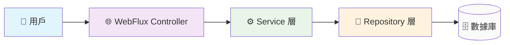

# 🌟 WebFlux 從零開始：初學者友好指南

> **目標讀者**：想要學習 Reactive 編程的開發者
> **學習路徑**：從基礎概念 → 簡單示例 → 架構理解 → 實戰應用

---

## 🚀 第一章：初學者入門 - 理解 Reactive 世界

### 🤔 什麼是 Reactive 編程？

想象一下，你在咖啡廳點餐的場景：

**傳統方式（同步）：**
1. 你點餐 → 服務員記錄 → 你等待 → 拿到咖啡 → 繼續做事
2. **問題**：你必須停下來等待，無法同時處理其他事情

**Reactive 方式（非同步）：**
1. 你點餐 → 服務員給你一個號碼牌 → 你繼續做事
2. 咖啡做好時，號碼牌會通知你 → 你去拿咖啡
3. **好處**：你可以在等待時做其他事情，提高效率

**Reactive 編程就是這樣**：讓程式在等待 I/O 操作時，能夠繼續處理其他任務！

### ❓ 為什麼需要 WebFlux？

在現代應用中，我們面臨這些挑戰：

#### 問題場景 1：高併發請求
```java
// ❌ 傳統 MVC：每個請求占用一個線程
@GetMapping("/users")
public List<User> getUsers() {
    // 這個請求會阻塞一個線程直到數據庫返回
    return userRepository.findAll();
}
```

**問題**：1000個用戶同時訪問，需要1000個線程！

#### 問題場景 2：慢速 I/O 操作
```java
// ❌ 傳統方式：線程等待外部 API
@GetMapping("/user-details")
public UserDetails getUserDetails() {
    User user = userService.getUser();        // 等待數據庫
    Address address = addressService.getAddress(); // 等待外部 API
    return combine(user, address);
}
```

**問題**：如果數據庫或外部 API 慢，整個請求就慢！

#### ✅ WebFlux 的解決方案
```java
// ✅ Reactive 方式：非阻塞處理
@GetMapping("/user-details")
public Mono<UserDetails> getUserDetails() {
    return Mono.zip(
        userService.getUserReactive(),        // 非阻塞
        addressService.getAddressReactive()   // 非阻塞
    ).map((user, address) -> combine(user, address));
}
```

**好處**：同一個線程可以處理多個請求！

### 🎯 WebFlux 的核心價值

| 傳統 MVC | WebFlux |
|---------|---------|
| **線程模型** | 一個請求一個線程 | 少量線程處理大量請求 |
| **I/O 處理** | 阻塞等待 | 非阻塞回調 |
| **資源利用** | 線程浪費 | 資源高效利用 |
| **併發能力** | 受限於線程數 | 高併發友好 |

---

### 🧭 高階理由：為什麼要用 Reactive（取代傳統阻塞式）

- **非阻塞（non-blocking）**：等待資料庫/IO 時不佔用執行緒，執行緒可去服務其他請求 → 更高併發。
- **更好的資源利用**：大量短 IO 等待場景下，少掉 thread context switching 與 thread pool 泄壓成本。
- **可組合（composability）**：`Mono`/`Flux` 自然串接多個 async 操作（DB、外部服務、cache），可讀性佳、易測試。
- **內建錯誤處理與背壓**：以 operator 在串流層面處理錯誤與流量控制，避免淹爆下游。

> 一句話：Reactive 把「等待」變成「讓出」，把「例外/流量控制」變成「資料流上的組態」。

## 🔧 第二章：核心概念 - Mono 與 Flux

### 📦 什麼是 Mono 和 Flux？

把它們想象成特殊的"盒子"：

#### 🍱 Mono<T> - 單一結果的盒子
```java
// Mono 就像一個最多裝一個物品的盒子
Mono<String> result = Mono.just("Hello World");

// 使用場景
Mono<User> user = userRepository.findById(1L);      // 查詢單一用戶
Mono<Void> saved = userRepository.save(user);       // 保存操作
Mono<Boolean> exists = userRepository.existsById(1L); // 存在性檢查
```

#### 📦 Flux<T> - 多個結果的盒子
```java
// Flux 就像一個能裝很多物品的盒子
Flux<String> results = Flux.just("A", "B", "C");

// 使用場景
Flux<User> users = userRepository.findAll();        // 查詢所有用戶
Flux<User> activeUsers = userRepository.findByStatus("ACTIVE"); // 條件查詢
```

### 🎮 簡單上手示例

#### 示例 1：基本使用
```java
@RestController
public class HelloController {

    // ❌ 傳統方式
    @GetMapping("/traditional")
    public String traditionalHello() {
        return "Hello World";
    }

    // ✅ Reactive 方式
    @GetMapping("/reactive")
    public Mono<String> reactiveHello() {
        return Mono.just("Hello World");
    }
}
```

#### 示例 2：數據庫查詢
```java
@Service
public class UserService {

    // ❌ 傳統方式
    public List<User> getAllUsers() {
        return userRepository.findAll(); // 阻塞等待
    }

    // ✅ Reactive 方式
    public Flux<User> getAllUsersReactive() {
        return userRepository.findAll(); // 立即返回，結果後續推送
    }
}
```

### 🔄 數據流的工作原理

```java
// 數據流就像自來水管
Flux<User> userStream = userRepository.findAll()
    .filter(user -> user.getAge() > 18)    // 🔧 過濾器：只留成年用戶
    .map(user -> user.getName())          // 🔧 轉換器：提取用戶名
    .take(10);                            // 🔧 限制器：只取前10個

// 訂閱數據流（打開水龍頭）
userStream.subscribe(
    name -> System.out.println(name),     // 📥 接收數據
    error -> System.err.println(error),  // ❌ 處理錯誤
    () -> System.out.println("完成")      // ✅ 處理完成
);
```

---

## 📊 第二章補充：List<T> vs Flux<T> - 資料結構深度對比

### 🎯 核心差異概覽

| 特性 | List<T> | Flux<T> |
|-----|---------|---------|
| **記憶體載入時機** | 立即載入全部數據 | 按需載入，串流處理 |
| **處理方式** | 同步批量處理 | 非同步串流處理 |
| **記憶體使用** | 全部數據常駐記憶體 | 數據流過後即可釋放 |
| **阻塞行為** | 會阻塞當前線程 | 不會阻塞線程 |
| **適合場景** | 小數據集、同步處理 | 大數據集、非同步處理 |

### 🔍 詳細比較說明

#### 1. **記憶體管理差異**

**List<T> 的記憶體行為：**
```java
// ❌ 一次性載入所有數據到記憶體
public List<User> getAllUsers() {
    List<User> users = userRepository.findAll(); // 100萬個用戶全部載入！
    return users; // 記憶體中同時存在100萬個User物件
}
```
**問題：** 如果有100萬個用戶，List會一次性將所有用戶載入到JVM堆記憶體中

**Flux<T> 的記憶體行為：**
```java
// ✅ 串流處理，數據逐個流過
public Flux<User> getAllUsersReactive() {
    return userRepository.findAll() // 不載入到記憶體
        .filter(user -> user.isActive()) // 過濾時才處理
        .take(100); // 只處理前100個
}
```
**優勢：** 記憶體使用量大幅降低，只需要處理當前數據項

#### 2. **處理時機差異**

**List<T> 的處理方式：**
```java
// 同步處理：必須等待所有數據準備完成
List<User> users = getAllUsers(); // 阻塞等待數據庫查詢完成
for (User user : users) {
    processUser(user); // 逐個處理，但前面已經全部載入
}
```

**Flux<T> 的處理方式：**
```java
// 非同步處理：數據到達時立即處理
getAllUsersReactive()
    .subscribe(user -> {
        // 每當有數據到達就立即處理
        processUser(user);
    });
```

#### 3. **錯誤處理差異**

**List<T> 的錯誤處理：**
```java
try {
    List<User> users = getAllUsers(); // 如果這裡出錯，整個操作失敗
    for (User user : users) {
        processUser(user); // 錯誤已經發生，這裡不會執行
    }
} catch (Exception e) {
    // 錯誤處理
}
```

**Flux<T> 的錯誤處理：**
```java
getAllUsersReactive()
    .map(user -> processUser(user))
    .onErrorResume(error -> {
        // 恢復邏輯：可以返回備用數據或空串流
        return Flux.empty();
    })
    .subscribe();
```

#### 4. **並發處理差異**

**List<T> 的並發處理：**
```java
List<User> users = getAllUsers(); // 先獲取所有數據
users.parallelStream() // 然後並行處理
    .forEach(user -> processUser(user));
```

**Flux<T> 的並發處理：**
```java
getAllUsersReactive()
    .flatMap(user -> processUserAsync(user), 10) // 限制並發數量
    .subscribe();
```

#### 5. **資源利用差異**

**List<T> 的資源使用：**
```java
// 資源使用曲線：前期高負載，後期閒置
// [數據庫查詢] → [載入記憶體] → [處理數據] → [返回結果]
List<User> result = queryAndProcessUsers();
return result;
```

**Flux<T> 的資源使用：**
```java
// 資源使用曲線：平滑分佈
// 數據流：數據庫 → 處理 → 訂閱者
return userRepository.findAll()
    .filter(this::isValidUser)
    .map(this::enrichUserData);
```

### 💡 選擇指南

#### 什麼時候選擇 List<T>？
```java
// ✅ 適合場景
public List<User> getTop10Users() {
    return userRepository.findTop10(); // 數據量小
}

public List<Product> getProductsByIds(List<Long> ids) {
    return productRepository.findByIdIn(ids); // ID列表已知
}
```

#### 什麼時候選擇 Flux<T>？
```java
// ✅ 適合場景
public Flux<Order> getAllOrders() {
    return orderRepository.findAll(); // 可能有大量數據
}

public Flux<User> searchUsers(String keyword) {
    return userRepository.findByNameContaining(keyword); // 搜索結果不確定
}
```

### 🔄 轉換實戰

#### List 轉 Flux：
```java
List<User> userList = getUsers();
Flux<User> userFlux = Flux.fromIterable(userList);
```

#### Flux 轉 List：
```java
Flux<User> userFlux = getUsersReactive();
Mono<List<User>> userList = userFlux.collectList();
```

#### 實際應用場景：
```java
@RestController
public class UserController {

    // 適合小數據集
    @GetMapping("/users/top10")
    public List<User> getTop10Users() {
        return userService.getTop10Users(); // 直接返回List
    }

    // 適合大數據集或串流處理
    @GetMapping("/users/stream")
    public Flux<User> getAllUsersStream() {
        return userService.getAllUsersReactive(); // 返回Flux
    }

    // 混合使用：Reactive處理，最後收集為List
    @GetMapping("/users/processed")
    public Mono<List<User>> getProcessedUsers() {
        return userService.getAllUsersReactive()
            .filter(user -> user.isActive())
            .collectList(); // 最後收集為List返回
    }
}
```

### 🎯 記憶重點

1. **List<T>**：同步、批量、記憶體常駐
2. **Flux<T>**：非同步、串流、記憶體友好
3. **選擇原則**：小數據用List，大數據用Flux
4. **轉換自由**：可以隨時在兩者間轉換
5. **性能考量**：Flux在高併發和大數據場景下更優

---

## 🏗️ 第三章：架構設計 - 系統工作流程

### 📊 簡單架構圖



### 🔄 請求處理流程

#### 同步請求流程（簡單理解）
```
1. 用戶發送請求 → WebFlux 接收
2. Controller 處理 → 調用 Service
3. Service 處理 → 調用 Repository
4. Repository 查詢數據庫 → 返回結果
5. 結果逐層返回給用戶
```

#### Reactive 請求流程（高效處理）
```
用戶請求 1 ──┐
用戶請求 2 ──┼─→ 同一個線程處理多個請求
用戶請求 3 ──┘
             │
             └─→ 非阻塞 I/O 操作
             │
             └─→ 結果返回時通知對應請求
```

### 🎨 觀察者模式解釋

Reactive 編程的核心是**觀察者模式**：

```java
// 就像報紙訂閱
Publisher（報社） ── 發佈新聞 ──→ Subscriber（訂閱者）
    ↑                                     │
    └──── 當有新聞時 ────────────────────┘
```

在 WebFlux 中：
- **Publisher**：數據的生產者（數據庫查詢、API 調用）
- **Subscriber**：數據的消費者（Controller、Service）
- **Subscription**：訂閱關係的管理

---

## 📋 第四章：實戰應用 - 常見使用場景

### 場景 1：簡單的數據查詢

```java
@RestController
@RequestMapping("/api/users")
public class UserController {

    @Autowired
    private UserService userService;

    // 查詢所有用戶
    @GetMapping
    public Flux<User> getAllUsers() {
        return userService.getAllUsers();
    }

    // 查詢單個用戶
    @GetMapping("/{id}")
    public Mono<User> getUserById(@PathVariable Long id) {
        return userService.getUserById(id);
    }
}
```

### 場景 2：數據處理管道

```java
@Service
public class UserService {

    public Flux<UserDTO> getActiveUsersWithDetails() {
        return userRepository.findByStatus("ACTIVE")
            .map(this::convertToDTO)                    // 轉換為 DTO
            .filter(dto -> dto.getAge() >= 18)          // 過濾未成年
            .sort(Comparator.comparing(UserDTO::getName)); // 按姓名排序
    }

    private UserDTO convertToDTO(User user) {
        return new UserDTO(user.getName(), user.getAge());
    }
}
```

### 場景 3：錯誤處理

```java
@RestController
public class UserController {

    @GetMapping("/users/{id}")
    public Mono<ResponseEntity<User>> getUser(@PathVariable Long id) {
        return userService.getUserById(id)
            .map(user -> ResponseEntity.ok(user))                    // 成功時返回用戶
            .defaultIfEmpty(ResponseEntity.notFound().build())      // 用戶不存在
            .onErrorResume(error ->                                  // 發生錯誤時
                Mono.just(ResponseEntity.status(500).build()));
    }
}
```

---

## 🔄 第五章：進階概念 - 背壓控制

### 💡 什麼是背壓？

背壓就像水龍頭的調節器：

```java
// 沒有背壓控制
Flux<User> users = userRepository.findAll(); // 可能返回100萬個用戶！
users.subscribe(user -> process(user));     // 記憶體爆炸！

// 有背壓控制
Flux<User> users = userRepository.findAll()
    .take(100)                              // 只取前100個
    .onBackpressureBuffer(50);              // 最多緩衝50個
```

### 🎛️ 背壓策略

```java
public Flux<User> getUsersWithBackpressure() {
    return userRepository.findAll()
        .take(1000)                         // 限制總數
        .onBackpressureBuffer(100)          // 緩衝區大小
        .onBackpressureDrop(user ->         // 超過時丟棄
            log.warn("Dropped user: {}", user.getName()));
}
```

---

## 🔬 第六章：實戰加值 - 控制器逐行拆解與常見寫法

### 針對這段程式：逐行理由（超細節）

原始：

```java
return peopleService.getAllPeople()               // Flux<Person>
    .collectList()                                // Mono<List<Person>>
    .map(people -> ResponseEntity.ok(people))     // Mono<ResponseEntity<List<Person>>>
    .onErrorResume(error -> Mono.just(
        ResponseEntity.internalServerError().build()));
```

逐行理由：

- `peopleService.getAllPeople()`：回傳 `Flux<Person>`，代表可能很多筆，資料會陸續到來。為何不用 `List`？因底層可能是 non-blocking driver/來源，`Flux` 才能把非同步元素串起來。
- `.collectList()`：把 `Flux` 聚合為 `Mono<List<Person>>`，等「所有人」到齊再一次回傳。若 API 需要完整 JSON 陣列才適合。注意大量資料會佔用記憶體；需要 streaming 時就別收集。
- `.map(people -> ResponseEntity.ok(people))`：同步把值包成 HTTP 回應，用 `map` 即可（不是另一個 `Mono`）。`map` vs `flatMap`：同步→`map`；若 lambda 內會回傳 `Mono/Flux`，才用 `flatMap`。
- `.onErrorResume(...)`：上游任一節點出錯時改以備援 Publisher 取代，能自訂 HTTP 狀態/內容。也可依情境改 `onErrorReturn`（固定值）、`onErrorMap`（轉例外）、或 `doOnError`（紀錄）。

### 常見替代寫法（何時用哪一種）

A. 直接回 `Flux`（stream/lazy）— 客戶端可逐筆消費或資料量大：

```java
@GetMapping("/people")
public Flux<Person> getAllPeople() {
    return peopleService.getAllPeople();
}
```

B. 回 `Mono<ResponseEntity<Flux<Person>>>`（需要自訂 header 或狀態）：

```java
@GetMapping("/people")
public Mono<ResponseEntity<Flux<Person>>> getAllPeople() {
    Flux<Person> flux = peopleService.getAllPeople();
    return Mono.just(ResponseEntity.ok().body(flux));
}
```

C. 回 `List`（一次要完整陣列；小量資料最簡單）：

```java
public Mono<ResponseEntity<List<Person>>> getAllPeople() { /* 如上 */ }
```

### Operator 心法：`map` / `flatMap` / `onErrorResume`

- **`map(T -> R)`**：同步把值轉成另一個值，`R` 不是 `Mono/Flux`。
- **`flatMap(T -> Mono<R>)`**：lambda 回傳 `Mono/Flux`（非同步），`flatMap` 會攤平。
- **`onErrorResume(e -> Mono<T>)`**：錯誤時切換到另一個 Publisher（可依例外型別決策）。
- 相關：`onErrorReturn(value)` 固定備援、`doOnError(e -> ...)` 僅副作用（例如 log）。

範例比較：

```java
// map（同步）
.collectList()
.map(list -> ResponseEntity.ok(list))

// flatMap（lambda 回傳 Mono）
.collectList()
.flatMap(list -> Mono.just(ResponseEntity.ok(list)))
// 兩者等價；此處用 flatMap 屬多餘，非同步時才需要。
```

### 注意事項（常踩到的坑）

- 別在 reactive chain 內做 blocking call（如 `jdbcTemplate.query(...)`、`Thread.sleep`、阻塞檔案 I/O）。
  - 若不得不 blocking：
    ```java
    return Mono.fromCallable(() -> blockingCall())
        .subscribeOn(Schedulers.boundedElastic());
    ```
- `collectList()` 會把所有元素放記憶體，資料量大請避免。
- Controller 端不要手動 `.subscribe()`，讓框架接手訂閱。
- 不要吞掉例外：
  ```java
  .doOnError(e -> log.error("getAllPeople failed", e))
  .onErrorResume(e -> Mono.just(ResponseEntity.status(500).build()));
  ```

### 記憶小技巧（AIM）

- **A = Aggregate**：是否要聚合成完整 `List`？
- **I = Immediate transform**：只是同步包裝（`map`）還是要非同步呼叫（`flatMap`）？
- **M = Manage errors**：要 fallback/預設值/直接 propagate？回 500 還是其他？

流程速記：

1) 數量？（多筆流→`Flux`；要一次拿完→`collectList`）
2) 轉換？（同步→`map`；非同步→`flatMap`）
3) 錯誤？（`onErrorResume/onErrorReturn`；僅 log→`doOnError`）

### 小練習

1) 把 `collectList()` 改成直接回 `Flux<Person>`（簡單 Controller）。
2) 模擬 service 丟錯：請記錄 log 並回 503（`onErrorResume` + `doOnError`）。
3) 從 cache（`Mono`）查不到才去 DB（`Flux`），把兩者串在一起（`switchIfEmpty` 或 `flatMapMany`）。

範例 1（直接回 Flux）：

```java
@GetMapping("/people")
public Flux<Person> getAllPeople() {
    return peopleService.getAllPeople(); // 框架會把 Flux 序列化
}
```

### Cache（Mono）查不到才去 DB（Flux）

核心 API：`switchIfEmpty`（上游無資料→切換到另一個 Publisher）。

```java
Mono<Person> cacheResult = cacheService.getPersonById(id); // Mono<Person>
Flux<Person> dbResult = peopleRepository.findById(id);     // Flux<Person>

return cacheResult
    .flatMapMany(Flux::just)   // Mono<Person> → Flux<Person>
    .switchIfEmpty(dbResult);  // cache miss → fallback to DB
```

若 DB 也是單筆（`Mono`）：

```java
return cacheResult.switchIfEmpty(dbResult); // 兩邊同為 Mono<Person>
```

放進 Controller 並處理錯誤（回 503）：

```java
@GetMapping("/person/{id}")
public Mono<ResponseEntity<Person>> getPerson(@PathVariable String id) {
    Mono<Person> cacheResult = cacheService.getPersonById(id);
    Mono<Person> dbResult = peopleRepository.findById(id);

    return cacheResult
        .switchIfEmpty(dbResult)
        .map(ResponseEntity::ok)
        .doOnError(e -> log.error("getPerson failed", e))
        .onErrorResume(e -> Mono.just(ResponseEntity.status(503).build()));
}
```

---

## 📨 第八章：與 MQ 整合 - Reactive 消費流程逐步解析

以 RabbitMQ 手動 ack 模式為例（示意）：

```java
@Component
public class ReactivePeopleConsumer {
    @PostConstruct
    public void startConsumers() {
        reactiveReceiver.consumeManualAck("people.get-all.queue", new ConsumeOptions().qos(2))
            .flatMap(delivery -> parseMessage(delivery.getBody())
                .flatMap(message -> {
                    String requestId = message.getRequestId();
                    return peopleService.getAllPeople()
                        .collectList()
                        .flatMap(people -> asyncResultService.sendCompletedResultReactive(requestId, people))
                        .doOnSuccess(v -> delivery.ack())
                        .onErrorResume(e -> asyncResultService.sendFailedResultReactive(requestId, e.getMessage())
                            .doOnSuccess(v -> delivery.nack(false)));
                }), 2) // 並發控制
            .subscribe();
    }
}
```

逐步說明：

- `consumeManualAck(..., qos(2))`：訂閱佇列（手動 ack），最多 2 筆未 ack 並行中。
- 外層 `flatMap`：每個 `delivery` 非同步處理後合併。
- `parseMessage(...)`：解析 JSON → `Mono<Message>`。
- 業務查詢：`getAllPeople().collectList()` → `Mono<List<Person>>`。
- 成功：`sendCompletedResultReactive(...)` 後 `delivery.ack()`。
- 失敗：`onErrorResume` 走 `sendFailedResultReactive(...)` 並 `delivery.nack(false)`（是否重回佇列視需求）。
- 結尾 `subscribe()`：啟動整個 pipeline（消費者常駐）。

## 🔧 第七章：實戰指南 - 遷移實戰

### 🎯 從 JPA 到 R2DBC 的遷移路徑

#### 階段 1：理解差異
```java
// ❌ 傳統 JPA
@Entity
public class User {
    @Id
    private Long id;
    private String name;
}

// ✅ R2DBC 實體
@Table("user")
public class User {
    @Id
    private Long id;
    private String name;
}
```

#### 階段 2：Repository 轉換
```java
// ❌ JPA Repository
public interface UserRepository extends JpaRepository<User, Long> {
    List<User> findByName(String name);
}

// ✅ R2DBC Repository
public interface UserRepository extends ReactiveCrudRepository<User, Long> {
    Flux<User> findByName(String name);
}
```

#### 階段 3：Service 層適配
```java
// ❌ 同步 Service
@Service
public class UserService {
    public List<User> getAllUsers() {
        return userRepository.findAll();
    }
}

// ✅ Reactive Service
@Service
public class UserService {
    public Flux<User> getAllUsers() {
        return userRepository.findAll();
    }
}
```

#### 階段 4：Controller 適配
```java
// ❌ MVC Controller
@RestController
public class UserController {
    @GetMapping("/users")
    public List<User> getUsers() {
        return userService.getAllUsers();
    }
}

// ✅ WebFlux Controller
@RestController
public class UserController {
    @GetMapping("/users")
    public Flux<User> getUsers() {
        return userService.getAllUsers();
    }
}
```

### 💡 常見問題解答

#### Q1：我一定要把整個項目都改成 Reactive 嗎？
**A**：不需要！可以採用漸進式遷移：
1. 先在新的 API 端點使用 WebFlux
2. 舊的 MVC 端點繼續運行
3. 逐步替換高負載的端點

#### Q2：學習 Reactive 難度大嗎？
**A**：其實不難！重點是：
1. 理解非同步思維
2. 掌握 Mono/Flux 的基本操作
3. 多寫代碼練習

#### Q3：性能真的會提升嗎？
**A**：在高併發場景下是的：
- **線程利用率**：從 1:1 變成 1:N
- **記憶體使用**：減少線程棧空間
- **響應時間**：減少阻塞等待

---

**Happy Coding! 🚀**

---

## ❓ 附錄 A：為什麼不用 try/catch？（Reactive 錯誤處理的本質）

- 傳統同步寫法：呼叫會「立刻」回傳，例外也會「立刻」丟出，所以 `try/catch` 能攔住。
- Reactive：`Flux/Mono` 是「未來的資料流」，錯誤在「訂閱」時才可能發生，離開了目前方法 scope，`try/catch` 幾乎攔不到。
- 正確作法：在 pipeline 中用 operator 處理。

```java
return peopleService.getAllPeople()
    .collectList()
    .map(ResponseEntity::ok)
    .doOnError(e -> log.error("getAllPeople failed", e))
    .onErrorResume(e -> Mono.just(ResponseEntity.internalServerError().build()));
```

---

## 🧩 附錄 B：flatMap 的底層邏輯（簡述）

- `map`：一對一，同步轉換，回普通值。
- `flatMap`：一對多/非同步，lambda 產生 `Publisher`，Reactor 幫你「展開並合併」。
- 直覺流程（簡化）：訂閱上游 → 對每個元素套 `mapper` 得到 `Publisher` → 訂閱每個內層 `Publisher` → 合併輸出與錯誤。

偽碼感：

```java
source.flatMap(mapper) ≈ Flux.create(emitter -> {
  source.subscribe(t -> {
    Publisher<R> inner = mapper.apply(t);
    inner.subscribe(emitter::next, emitter::error, () -> {});
  }, emitter::error, emitter::complete);
});
```

---

## 🪄 附錄 C：匿名類別 → lambda（演進速查）

介面：

```java
public interface Consumer<T> { void accept(T t); }
```

有名類別：

```java
class PrintConsumer implements Consumer<String> {
  public void accept(String s) { System.out.println(s); }
}
names.forEach(new PrintConsumer());
```

匿名類別：

```java
names.forEach(new Consumer<String>() {
  @Override public void accept(String s) { System.out.println(s); }
});
```

lambda（SAM 介面）：

```java
names.forEach(s -> System.out.println(s));
```
